https://www.kaggle.com/code/datafan07/disaster-tweets-nlp-eda-bert-with-transformers

# Download data with API


```python
!kaggle competitions download -c nlp-getting-started
```

    Warning: Your Kaggle API key is readable by other users on this system! To fix this, you can run 'chmod 600 /Users/hoonkijeong/.kaggle/kaggle.json'
    Downloading nlp-getting-started.zip to /Users/hoonkijeong/Desktop/kaggle/NLP_with_disaster_tweets
      0%|                                                | 0.00/593k [00:00<?, ?B/s]
    100%|████████████████████████████████████████| 593k/593k [00:00<00:00, 16.4MB/s]


# Unzip the zip file


```python
import zipfile
with zipfile.ZipFile('./nlp-getting-started.zip', 'r') as zip_ref:
    zip_ref.extractall('.')
```

# Load data


```python
# Most basic stuff for EDA.

import pandas as pd
import numpy as np
import matplotlib.pyplot as plt
import seaborn as sns

# Core packages for text processing.

import string
import re

# Libraries for text preprocessing.

import nltk
nltk.download('stopwords')
nltk.download('punkt')
nltk.download('averaged_perceptron_tagger')
nltk.download('wordnet')
from nltk.corpus import stopwords, wordnet
from nltk.stem import WordNetLemmatizer
from nltk.tokenize import word_tokenize
from nltk.probability import FreqDist

# Loading some sklearn packaces for modelling.

from sklearn.feature_extraction.text import CountVectorizer, TfidfVectorizer
from sklearn.decomposition import LatentDirichletAllocation, NMF
from sklearn.metrics import f1_score, accuracy_score

# Some packages for word clouds and NER.

from wordcloud import WordCloud, STOPWORDS
from collections import Counter, defaultdict
from PIL import Image
import spacy
#!pip install https://github.com/explosion/spacy-models/releases/download/en_core_web_sm-2.2.5/en_core_web_sm-2.2.5.tar.gz
import en_core_web_sm

# Core packages for general use throughout the notebook.

import random
import warnings
import time
import datetime

# For customizing our plots.

from matplotlib.ticker import MaxNLocator
import matplotlib.gridspec as gridspec
import matplotlib.patches as mpatches

# Loading pytorch packages.

import torch
from transformers import BertTokenizer, BertForSequenceClassification, AdamW, BertConfig, get_linear_schedule_with_warmup
from torch.utils.data import TensorDataset, random_split, DataLoader, RandomSampler, SequentialSampler

# Setting some options for general use.

stop = set(stopwords.words('english'))
plt.style.use('fivethirtyeight')
sns.set(font_scale=1.5)
pd.options.display.max_columns = 250
pd.options.display.max_rows = 250
warnings.filterwarnings('ignore')


#Setting seeds for consistent results.
seed_val = 42
random.seed(seed_val)
np.random.seed(seed_val)
torch.manual_seed(seed_val)
torch.cuda.manual_seed_all(seed_val)
```

    [nltk_data] Downloading package stopwords to
    [nltk_data]     /Users/hoonkijeong/nltk_data...
    [nltk_data]   Package stopwords is already up-to-date!
    [nltk_data] Downloading package punkt to
    [nltk_data]     /Users/hoonkijeong/nltk_data...
    [nltk_data]   Package punkt is already up-to-date!
    [nltk_data] Downloading package averaged_perceptron_tagger to
    [nltk_data]     /Users/hoonkijeong/nltk_data...
    [nltk_data]   Package averaged_perceptron_tagger is already up-to-
    [nltk_data]       date!
    [nltk_data] Downloading package wordnet to
    [nltk_data]     /Users/hoonkijeong/nltk_data...
    [nltk_data]   Package wordnet is already up-to-date!


```python
# Loading the train and test data for visualization & exploration.

trainv = pd.read_csv('./train.csv')
testv = pd.read_csv('./test.csv')
```


```python
# Taking general look at the both datasets.

display(trainv.sample(5))
display(testv.sample(5))
```


<div>
<style scoped>
    .dataframe tbody tr th:only-of-type {
        vertical-align: middle;
    }

    .dataframe tbody tr th {
        vertical-align: top;
    }
    
    .dataframe thead th {
        text-align: right;
    }
</style>
<table border="1" class="dataframe">
  <thead>
    <tr style="text-align: right;">
      <th></th>
      <th>id</th>
      <th>keyword</th>
      <th>location</th>
      <th>text</th>
      <th>target</th>
    </tr>
  </thead>
  <tbody>
    <tr>
      <th>2644</th>
      <td>3796</td>
      <td>destruction</td>
      <td>NaN</td>
      <td>So you have a new weapon that can cause un-ima...</td>
      <td>1</td>
    </tr>
    <tr>
      <th>2227</th>
      <td>3185</td>
      <td>deluge</td>
      <td>NaN</td>
      <td>The f$&amp;amp;@ing things I do for #GISHWHES Just...</td>
      <td>0</td>
    </tr>
    <tr>
      <th>5448</th>
      <td>7769</td>
      <td>police</td>
      <td>UK</td>
      <td>DT @georgegalloway: RT @Galloway4Mayor: ‰ÛÏThe...</td>
      <td>1</td>
    </tr>
    <tr>
      <th>132</th>
      <td>191</td>
      <td>aftershock</td>
      <td>NaN</td>
      <td>Aftershock back to school kick off was great. ...</td>
      <td>0</td>
    </tr>
    <tr>
      <th>6845</th>
      <td>9810</td>
      <td>trauma</td>
      <td>Montgomery County, MD</td>
      <td>in response to trauma Children of Addicts deve...</td>
      <td>0</td>
    </tr>
  </tbody>
</table>
</div>


<div>
<style scoped>
    .dataframe tbody tr th:only-of-type {
        vertical-align: middle;
    }

    .dataframe tbody tr th {
        vertical-align: top;
    }
    
    .dataframe thead th {
        text-align: right;
    }
</style>
<table border="1" class="dataframe">
  <thead>
    <tr style="text-align: right;">
      <th></th>
      <th>id</th>
      <th>keyword</th>
      <th>location</th>
      <th>text</th>
    </tr>
  </thead>
  <tbody>
    <tr>
      <th>142</th>
      <td>449</td>
      <td>armageddon</td>
      <td>1996???????????</td>
      <td>UNIVERSAL ORDER OF ARMAGEDDON http://t.co/3tY4mGm</td>
    </tr>
    <tr>
      <th>2672</th>
      <td>8915</td>
      <td>snowstorm</td>
      <td>Los Angeles</td>
      <td>@BigBang_CBS ...wow...ok...um...that was like ...</td>
    </tr>
    <tr>
      <th>2605</th>
      <td>8682</td>
      <td>sinkhole</td>
      <td>New York, New York</td>
      <td>The sinkhole that ate Brooklyn http://t.co/28r...</td>
    </tr>
    <tr>
      <th>2515</th>
      <td>8381</td>
      <td>ruin</td>
      <td>Monroe, OH</td>
      <td>Don't ruin a good today by thinking about a ba...</td>
    </tr>
    <tr>
      <th>958</th>
      <td>3187</td>
      <td>deluge</td>
      <td>West Powelton, Philadelphia</td>
      <td>I'm havin previous life flashbacks of when i l...</td>
    </tr>
  </tbody>
</table>
</div>


```python
print(trainv.shape)
print(testv.shape)
```

    (7613, 5)
    (3263, 4)


```python
# Some basic helper functions to clean text by removing urls, emojis, html tags and punctuations.

def remove_URL(text):
    url = re.compile(r'https?://\S+|www\.\S+')
    return url.sub(r'', text)


def remove_emoji(text):
    emoji_pattern = re.compile(
        '['
        u'\U0001F600-\U0001F64F'  # emoticons
        u'\U0001F300-\U0001F5FF'  # symbols & pictographs
        u'\U0001F680-\U0001F6FF'  # transport & map symbols
        u'\U0001F1E0-\U0001F1FF'  # flags (iOS)
        u'\U00002702-\U000027B0'
        u'\U000024C2-\U0001F251'
        ']+',
        flags=re.UNICODE)
    return emoji_pattern.sub(r'', text)


def remove_html(text):
    html = re.compile(r'<.*?>|&([a-z0-9]+|#[0-9]{1,6}|#x[0-9a-f]{1,6});')
    return re.sub(html, '', text)


def remove_punct(text):
    table = str.maketrans('', '', string.punctuation)
    return text.translate(table)

# Applying helper functions

trainv['text_clean'] = trainv['text'].apply(lambda x: remove_URL(x))
trainv['text_clean'] = trainv['text_clean'].apply(lambda x: remove_emoji(x))
trainv['text_clean'] = trainv['text_clean'].apply(lambda x: remove_html(x))
trainv['text_clean'] = trainv['text_clean'].apply(lambda x: remove_punct(x))
```


```python
trainv['tokenized'] = trainv['text_clean'].apply(word_tokenize)

trainv.head()
```


<div>
<style scoped>
    .dataframe tbody tr th:only-of-type {
        vertical-align: middle;
    }

    .dataframe tbody tr th {
        vertical-align: top;
    }
    
    .dataframe thead th {
        text-align: right;
    }
</style>
<table border="1" class="dataframe">
  <thead>
    <tr style="text-align: right;">
      <th></th>
      <th>id</th>
      <th>keyword</th>
      <th>location</th>
      <th>text</th>
      <th>target</th>
      <th>text_clean</th>
      <th>tokenized</th>
    </tr>
  </thead>
  <tbody>
    <tr>
      <th>0</th>
      <td>1</td>
      <td>NaN</td>
      <td>NaN</td>
      <td>Our Deeds are the Reason of this #earthquake M...</td>
      <td>1</td>
      <td>Our Deeds are the Reason of this earthquake Ma...</td>
      <td>[Our, Deeds, are, the, Reason, of, this, earth...</td>
    </tr>
    <tr>
      <th>1</th>
      <td>4</td>
      <td>NaN</td>
      <td>NaN</td>
      <td>Forest fire near La Ronge Sask. Canada</td>
      <td>1</td>
      <td>Forest fire near La Ronge Sask Canada</td>
      <td>[Forest, fire, near, La, Ronge, Sask, Canada]</td>
    </tr>
    <tr>
      <th>2</th>
      <td>5</td>
      <td>NaN</td>
      <td>NaN</td>
      <td>All residents asked to 'shelter in place' are ...</td>
      <td>1</td>
      <td>All residents asked to shelter in place are be...</td>
      <td>[All, residents, asked, to, shelter, in, place...</td>
    </tr>
    <tr>
      <th>3</th>
      <td>6</td>
      <td>NaN</td>
      <td>NaN</td>
      <td>13,000 people receive #wildfires evacuation or...</td>
      <td>1</td>
      <td>13000 people receive wildfires evacuation orde...</td>
      <td>[13000, people, receive, wildfires, evacuation...</td>
    </tr>
    <tr>
      <th>4</th>
      <td>7</td>
      <td>NaN</td>
      <td>NaN</td>
      <td>Just got sent this photo from Ruby #Alaska as ...</td>
      <td>1</td>
      <td>Just got sent this photo from Ruby Alaska as s...</td>
      <td>[Just, got, sent, this, photo, from, Ruby, Ala...</td>
    </tr>
  </tbody>
</table>
</div>


```python
# Lower casing clean text.

trainv['lower'] = trainv['tokenized'].apply(
    lambda x: [word.lower() for word in x])

trainv.head()
```


<div>
<style scoped>
    .dataframe tbody tr th:only-of-type {
        vertical-align: middle;
    }

    .dataframe tbody tr th {
        vertical-align: top;
    }
    
    .dataframe thead th {
        text-align: right;
    }
</style>
<table border="1" class="dataframe">
  <thead>
    <tr style="text-align: right;">
      <th></th>
      <th>id</th>
      <th>keyword</th>
      <th>location</th>
      <th>text</th>
      <th>target</th>
      <th>text_clean</th>
      <th>tokenized</th>
      <th>lower</th>
    </tr>
  </thead>
  <tbody>
    <tr>
      <th>0</th>
      <td>1</td>
      <td>NaN</td>
      <td>NaN</td>
      <td>Our Deeds are the Reason of this #earthquake M...</td>
      <td>1</td>
      <td>Our Deeds are the Reason of this earthquake Ma...</td>
      <td>[Our, Deeds, are, the, Reason, of, this, earth...</td>
      <td>[our, deeds, are, the, reason, of, this, earth...</td>
    </tr>
    <tr>
      <th>1</th>
      <td>4</td>
      <td>NaN</td>
      <td>NaN</td>
      <td>Forest fire near La Ronge Sask. Canada</td>
      <td>1</td>
      <td>Forest fire near La Ronge Sask Canada</td>
      <td>[Forest, fire, near, La, Ronge, Sask, Canada]</td>
      <td>[forest, fire, near, la, ronge, sask, canada]</td>
    </tr>
    <tr>
      <th>2</th>
      <td>5</td>
      <td>NaN</td>
      <td>NaN</td>
      <td>All residents asked to 'shelter in place' are ...</td>
      <td>1</td>
      <td>All residents asked to shelter in place are be...</td>
      <td>[All, residents, asked, to, shelter, in, place...</td>
      <td>[all, residents, asked, to, shelter, in, place...</td>
    </tr>
    <tr>
      <th>3</th>
      <td>6</td>
      <td>NaN</td>
      <td>NaN</td>
      <td>13,000 people receive #wildfires evacuation or...</td>
      <td>1</td>
      <td>13000 people receive wildfires evacuation orde...</td>
      <td>[13000, people, receive, wildfires, evacuation...</td>
      <td>[13000, people, receive, wildfires, evacuation...</td>
    </tr>
    <tr>
      <th>4</th>
      <td>7</td>
      <td>NaN</td>
      <td>NaN</td>
      <td>Just got sent this photo from Ruby #Alaska as ...</td>
      <td>1</td>
      <td>Just got sent this photo from Ruby Alaska as s...</td>
      <td>[Just, got, sent, this, photo, from, Ruby, Ala...</td>
      <td>[just, got, sent, this, photo, from, ruby, ala...</td>
    </tr>
  </tbody>
</table>
</div>


```python
# Removing stopwords.

trainv['stopwords_removed'] = trainv['lower'].apply(
    lambda x: [word for word in x if word not in stop])

trainv.head()
```


<div>
<style scoped>
    .dataframe tbody tr th:only-of-type {
        vertical-align: middle;
    }

    .dataframe tbody tr th {
        vertical-align: top;
    }
    
    .dataframe thead th {
        text-align: right;
    }
</style>
<table border="1" class="dataframe">
  <thead>
    <tr style="text-align: right;">
      <th></th>
      <th>id</th>
      <th>keyword</th>
      <th>location</th>
      <th>text</th>
      <th>target</th>
      <th>text_clean</th>
      <th>tokenized</th>
      <th>lower</th>
      <th>stopwords_removed</th>
    </tr>
  </thead>
  <tbody>
    <tr>
      <th>0</th>
      <td>1</td>
      <td>NaN</td>
      <td>NaN</td>
      <td>Our Deeds are the Reason of this #earthquake M...</td>
      <td>1</td>
      <td>Our Deeds are the Reason of this earthquake Ma...</td>
      <td>[Our, Deeds, are, the, Reason, of, this, earth...</td>
      <td>[our, deeds, are, the, reason, of, this, earth...</td>
      <td>[deeds, reason, earthquake, may, allah, forgiv...</td>
    </tr>
    <tr>
      <th>1</th>
      <td>4</td>
      <td>NaN</td>
      <td>NaN</td>
      <td>Forest fire near La Ronge Sask. Canada</td>
      <td>1</td>
      <td>Forest fire near La Ronge Sask Canada</td>
      <td>[Forest, fire, near, La, Ronge, Sask, Canada]</td>
      <td>[forest, fire, near, la, ronge, sask, canada]</td>
      <td>[forest, fire, near, la, ronge, sask, canada]</td>
    </tr>
    <tr>
      <th>2</th>
      <td>5</td>
      <td>NaN</td>
      <td>NaN</td>
      <td>All residents asked to 'shelter in place' are ...</td>
      <td>1</td>
      <td>All residents asked to shelter in place are be...</td>
      <td>[All, residents, asked, to, shelter, in, place...</td>
      <td>[all, residents, asked, to, shelter, in, place...</td>
      <td>[residents, asked, shelter, place, notified, o...</td>
    </tr>
    <tr>
      <th>3</th>
      <td>6</td>
      <td>NaN</td>
      <td>NaN</td>
      <td>13,000 people receive #wildfires evacuation or...</td>
      <td>1</td>
      <td>13000 people receive wildfires evacuation orde...</td>
      <td>[13000, people, receive, wildfires, evacuation...</td>
      <td>[13000, people, receive, wildfires, evacuation...</td>
      <td>[13000, people, receive, wildfires, evacuation...</td>
    </tr>
    <tr>
      <th>4</th>
      <td>7</td>
      <td>NaN</td>
      <td>NaN</td>
      <td>Just got sent this photo from Ruby #Alaska as ...</td>
      <td>1</td>
      <td>Just got sent this photo from Ruby Alaska as s...</td>
      <td>[Just, got, sent, this, photo, from, Ruby, Ala...</td>
      <td>[just, got, sent, this, photo, from, ruby, ala...</td>
      <td>[got, sent, photo, ruby, alaska, smoke, wildfi...</td>
    </tr>
  </tbody>
</table>
</div>


```python
# Applying part of speech tags.

trainv['pos_tags'] = trainv['stopwords_removed'].apply(nltk.tag.pos_tag)

trainv.head()
```


<div>
<style scoped>
    .dataframe tbody tr th:only-of-type {
        vertical-align: middle;
    }

    .dataframe tbody tr th {
        vertical-align: top;
    }
    
    .dataframe thead th {
        text-align: right;
    }
</style>
<table border="1" class="dataframe">
  <thead>
    <tr style="text-align: right;">
      <th></th>
      <th>id</th>
      <th>keyword</th>
      <th>location</th>
      <th>text</th>
      <th>target</th>
      <th>text_clean</th>
      <th>tokenized</th>
      <th>lower</th>
      <th>stopwords_removed</th>
      <th>pos_tags</th>
    </tr>
  </thead>
  <tbody>
    <tr>
      <th>0</th>
      <td>1</td>
      <td>NaN</td>
      <td>NaN</td>
      <td>Our Deeds are the Reason of this #earthquake M...</td>
      <td>1</td>
      <td>Our Deeds are the Reason of this earthquake Ma...</td>
      <td>[Our, Deeds, are, the, Reason, of, this, earth...</td>
      <td>[our, deeds, are, the, reason, of, this, earth...</td>
      <td>[deeds, reason, earthquake, may, allah, forgiv...</td>
      <td>[(deeds, NNS), (reason, NN), (earthquake, NN),...</td>
    </tr>
    <tr>
      <th>1</th>
      <td>4</td>
      <td>NaN</td>
      <td>NaN</td>
      <td>Forest fire near La Ronge Sask. Canada</td>
      <td>1</td>
      <td>Forest fire near La Ronge Sask Canada</td>
      <td>[Forest, fire, near, La, Ronge, Sask, Canada]</td>
      <td>[forest, fire, near, la, ronge, sask, canada]</td>
      <td>[forest, fire, near, la, ronge, sask, canada]</td>
      <td>[(forest, JJS), (fire, NN), (near, IN), (la, J...</td>
    </tr>
    <tr>
      <th>2</th>
      <td>5</td>
      <td>NaN</td>
      <td>NaN</td>
      <td>All residents asked to 'shelter in place' are ...</td>
      <td>1</td>
      <td>All residents asked to shelter in place are be...</td>
      <td>[All, residents, asked, to, shelter, in, place...</td>
      <td>[all, residents, asked, to, shelter, in, place...</td>
      <td>[residents, asked, shelter, place, notified, o...</td>
      <td>[(residents, NNS), (asked, VBD), (shelter, JJ)...</td>
    </tr>
    <tr>
      <th>3</th>
      <td>6</td>
      <td>NaN</td>
      <td>NaN</td>
      <td>13,000 people receive #wildfires evacuation or...</td>
      <td>1</td>
      <td>13000 people receive wildfires evacuation orde...</td>
      <td>[13000, people, receive, wildfires, evacuation...</td>
      <td>[13000, people, receive, wildfires, evacuation...</td>
      <td>[13000, people, receive, wildfires, evacuation...</td>
      <td>[(13000, CD), (people, NNS), (receive, JJ), (w...</td>
    </tr>
    <tr>
      <th>4</th>
      <td>7</td>
      <td>NaN</td>
      <td>NaN</td>
      <td>Just got sent this photo from Ruby #Alaska as ...</td>
      <td>1</td>
      <td>Just got sent this photo from Ruby Alaska as s...</td>
      <td>[Just, got, sent, this, photo, from, Ruby, Ala...</td>
      <td>[just, got, sent, this, photo, from, ruby, ala...</td>
      <td>[got, sent, photo, ruby, alaska, smoke, wildfi...</td>
      <td>[(got, VBD), (sent, JJ), (photo, NN), (ruby, N...</td>
    </tr>
  </tbody>
</table>
</div>


```python
# Converting part of speeches to wordnet format.

def get_wordnet_pos(tag):
    if tag.startswith('J'):
        return wordnet.ADJ
    elif tag.startswith('V'):
        return wordnet.VERB
    elif tag.startswith('N'):
        return wordnet.NOUN
    elif tag.startswith('R'):
        return wordnet.ADV
    else:
        return wordnet.NOUN


trainv['wordnet_pos'] = trainv['pos_tags'].apply(
    lambda x: [(word, get_wordnet_pos(pos_tag)) for (word, pos_tag) in x])

trainv.head()
```


<div>
<style scoped>
    .dataframe tbody tr th:only-of-type {
        vertical-align: middle;
    }

    .dataframe tbody tr th {
        vertical-align: top;
    }
    
    .dataframe thead th {
        text-align: right;
    }
</style>
<table border="1" class="dataframe">
  <thead>
    <tr style="text-align: right;">
      <th></th>
      <th>id</th>
      <th>keyword</th>
      <th>location</th>
      <th>text</th>
      <th>target</th>
      <th>text_clean</th>
      <th>tokenized</th>
      <th>lower</th>
      <th>stopwords_removed</th>
      <th>pos_tags</th>
      <th>wordnet_pos</th>
    </tr>
  </thead>
  <tbody>
    <tr>
      <th>0</th>
      <td>1</td>
      <td>NaN</td>
      <td>NaN</td>
      <td>Our Deeds are the Reason of this #earthquake M...</td>
      <td>1</td>
      <td>Our Deeds are the Reason of this earthquake Ma...</td>
      <td>[Our, Deeds, are, the, Reason, of, this, earth...</td>
      <td>[our, deeds, are, the, reason, of, this, earth...</td>
      <td>[deeds, reason, earthquake, may, allah, forgiv...</td>
      <td>[(deeds, NNS), (reason, NN), (earthquake, NN),...</td>
      <td>[(deeds, n), (reason, n), (earthquake, n), (ma...</td>
    </tr>
    <tr>
      <th>1</th>
      <td>4</td>
      <td>NaN</td>
      <td>NaN</td>
      <td>Forest fire near La Ronge Sask. Canada</td>
      <td>1</td>
      <td>Forest fire near La Ronge Sask Canada</td>
      <td>[Forest, fire, near, La, Ronge, Sask, Canada]</td>
      <td>[forest, fire, near, la, ronge, sask, canada]</td>
      <td>[forest, fire, near, la, ronge, sask, canada]</td>
      <td>[(forest, JJS), (fire, NN), (near, IN), (la, J...</td>
      <td>[(forest, a), (fire, n), (near, n), (la, a), (...</td>
    </tr>
    <tr>
      <th>2</th>
      <td>5</td>
      <td>NaN</td>
      <td>NaN</td>
      <td>All residents asked to 'shelter in place' are ...</td>
      <td>1</td>
      <td>All residents asked to shelter in place are be...</td>
      <td>[All, residents, asked, to, shelter, in, place...</td>
      <td>[all, residents, asked, to, shelter, in, place...</td>
      <td>[residents, asked, shelter, place, notified, o...</td>
      <td>[(residents, NNS), (asked, VBD), (shelter, JJ)...</td>
      <td>[(residents, n), (asked, v), (shelter, a), (pl...</td>
    </tr>
    <tr>
      <th>3</th>
      <td>6</td>
      <td>NaN</td>
      <td>NaN</td>
      <td>13,000 people receive #wildfires evacuation or...</td>
      <td>1</td>
      <td>13000 people receive wildfires evacuation orde...</td>
      <td>[13000, people, receive, wildfires, evacuation...</td>
      <td>[13000, people, receive, wildfires, evacuation...</td>
      <td>[13000, people, receive, wildfires, evacuation...</td>
      <td>[(13000, CD), (people, NNS), (receive, JJ), (w...</td>
      <td>[(13000, n), (people, n), (receive, a), (wildf...</td>
    </tr>
    <tr>
      <th>4</th>
      <td>7</td>
      <td>NaN</td>
      <td>NaN</td>
      <td>Just got sent this photo from Ruby #Alaska as ...</td>
      <td>1</td>
      <td>Just got sent this photo from Ruby Alaska as s...</td>
      <td>[Just, got, sent, this, photo, from, Ruby, Ala...</td>
      <td>[just, got, sent, this, photo, from, ruby, ala...</td>
      <td>[got, sent, photo, ruby, alaska, smoke, wildfi...</td>
      <td>[(got, VBD), (sent, JJ), (photo, NN), (ruby, N...</td>
      <td>[(got, v), (sent, a), (photo, n), (ruby, n), (...</td>
    </tr>
  </tbody>
</table>
</div>


```python
# Applying word lemmatizer.

wnl = WordNetLemmatizer()

trainv['lemmatized'] = trainv['wordnet_pos'].apply(
    lambda x: [wnl.lemmatize(word, tag) for word, tag in x])

trainv['lemmatized'] = trainv['lemmatized'].apply(
    lambda x: [word for word in x if word not in stop])

trainv['lemma_str'] = [' '.join(map(str, l)) for l in trainv['lemmatized']]

trainv.head()
```


<div>
<style scoped>
    .dataframe tbody tr th:only-of-type {
        vertical-align: middle;
    }

    .dataframe tbody tr th {
        vertical-align: top;
    }
    
    .dataframe thead th {
        text-align: right;
    }
</style>
<table border="1" class="dataframe">
  <thead>
    <tr style="text-align: right;">
      <th></th>
      <th>id</th>
      <th>keyword</th>
      <th>location</th>
      <th>text</th>
      <th>target</th>
      <th>text_clean</th>
      <th>tokenized</th>
      <th>lower</th>
      <th>stopwords_removed</th>
      <th>pos_tags</th>
      <th>wordnet_pos</th>
      <th>lemmatized</th>
      <th>lemma_str</th>
    </tr>
  </thead>
  <tbody>
    <tr>
      <th>0</th>
      <td>1</td>
      <td>NaN</td>
      <td>NaN</td>
      <td>Our Deeds are the Reason of this #earthquake M...</td>
      <td>1</td>
      <td>Our Deeds are the Reason of this earthquake Ma...</td>
      <td>[Our, Deeds, are, the, Reason, of, this, earth...</td>
      <td>[our, deeds, are, the, reason, of, this, earth...</td>
      <td>[deeds, reason, earthquake, may, allah, forgiv...</td>
      <td>[(deeds, NNS), (reason, NN), (earthquake, NN),...</td>
      <td>[(deeds, n), (reason, n), (earthquake, n), (ma...</td>
      <td>[deed, reason, earthquake, may, allah, forgive...</td>
      <td>deed reason earthquake may allah forgive u</td>
    </tr>
    <tr>
      <th>1</th>
      <td>4</td>
      <td>NaN</td>
      <td>NaN</td>
      <td>Forest fire near La Ronge Sask. Canada</td>
      <td>1</td>
      <td>Forest fire near La Ronge Sask Canada</td>
      <td>[Forest, fire, near, La, Ronge, Sask, Canada]</td>
      <td>[forest, fire, near, la, ronge, sask, canada]</td>
      <td>[forest, fire, near, la, ronge, sask, canada]</td>
      <td>[(forest, JJS), (fire, NN), (near, IN), (la, J...</td>
      <td>[(forest, a), (fire, n), (near, n), (la, a), (...</td>
      <td>[forest, fire, near, la, ronge, sask, canada]</td>
      <td>forest fire near la ronge sask canada</td>
    </tr>
    <tr>
      <th>2</th>
      <td>5</td>
      <td>NaN</td>
      <td>NaN</td>
      <td>All residents asked to 'shelter in place' are ...</td>
      <td>1</td>
      <td>All residents asked to shelter in place are be...</td>
      <td>[All, residents, asked, to, shelter, in, place...</td>
      <td>[all, residents, asked, to, shelter, in, place...</td>
      <td>[residents, asked, shelter, place, notified, o...</td>
      <td>[(residents, NNS), (asked, VBD), (shelter, JJ)...</td>
      <td>[(residents, n), (asked, v), (shelter, a), (pl...</td>
      <td>[resident, ask, shelter, place, notify, office...</td>
      <td>resident ask shelter place notify officer evac...</td>
    </tr>
    <tr>
      <th>3</th>
      <td>6</td>
      <td>NaN</td>
      <td>NaN</td>
      <td>13,000 people receive #wildfires evacuation or...</td>
      <td>1</td>
      <td>13000 people receive wildfires evacuation orde...</td>
      <td>[13000, people, receive, wildfires, evacuation...</td>
      <td>[13000, people, receive, wildfires, evacuation...</td>
      <td>[13000, people, receive, wildfires, evacuation...</td>
      <td>[(13000, CD), (people, NNS), (receive, JJ), (w...</td>
      <td>[(13000, n), (people, n), (receive, a), (wildf...</td>
      <td>[13000, people, receive, wildfire, evacuation,...</td>
      <td>13000 people receive wildfire evacuation order...</td>
    </tr>
    <tr>
      <th>4</th>
      <td>7</td>
      <td>NaN</td>
      <td>NaN</td>
      <td>Just got sent this photo from Ruby #Alaska as ...</td>
      <td>1</td>
      <td>Just got sent this photo from Ruby Alaska as s...</td>
      <td>[Just, got, sent, this, photo, from, Ruby, Ala...</td>
      <td>[just, got, sent, this, photo, from, ruby, ala...</td>
      <td>[got, sent, photo, ruby, alaska, smoke, wildfi...</td>
      <td>[(got, VBD), (sent, JJ), (photo, NN), (ruby, N...</td>
      <td>[(got, v), (sent, a), (photo, n), (ruby, n), (...</td>
      <td>[get, sent, photo, ruby, alaska, smoke, wildfi...</td>
      <td>get sent photo ruby alaska smoke wildfires pou...</td>
    </tr>
  </tbody>
</table>
</div>


```python
fig, axes = plt.subplots(ncols=2, nrows=1, figsize=(18, 6), dpi=100)
sns.countplot(trainv['target'], ax=axes[0])
axes[1].pie(trainv['target'].value_counts(),
            labels=['Not Disaster', 'Disaster'],
            autopct='%1.2f%%',
            shadow=True,
            explode=(0.05, 0),
            startangle=60)
fig.suptitle('Distribution of the Tweets', fontsize=24)
plt.show()
```


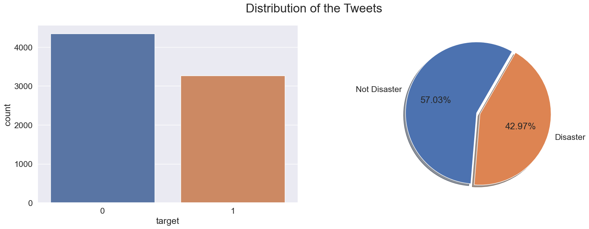


```python
# Creating a new feature for the visualization.

trainv['Character Count'] = trainv['text_clean'].apply(lambda x: len(str(x)))


def plot_dist3(df, feature, title):
    # Creating a customized chart. and giving in figsize and everything.
    fig = plt.figure(constrained_layout=True, figsize=(18, 8))
    # Creating a grid of 3 cols and 3 rows.
    grid = gridspec.GridSpec(ncols=3, nrows=2, figure=fig)

    # Customizing the histogram grid.
    ax1 = fig.add_subplot(grid[0, :2])
    # Set the title.
    ax1.set_title('Histogram')
    # plot the histogram.
    sns.distplot(df.loc[:, feature],
                 hist=True,
                 kde=True,
                 ax=ax1,
                 color='#e74c3c')
    ax1.set(ylabel='Frequency')
    ax1.xaxis.set_major_locator(MaxNLocator(nbins=20))

    # Customizing the ecdf_plot.
    ax2 = fig.add_subplot(grid[1, :2])
    # Set the title.
    ax2.set_title('Empirical CDF')
    # Plotting the ecdf_Plot.
    sns.distplot(df.loc[:, feature],
                 ax=ax2,
                 kde_kws={'cumulative': True},
                 hist_kws={'cumulative': True},
                 color='#e74c3c')
    ax2.xaxis.set_major_locator(MaxNLocator(nbins=20))
    ax2.set(ylabel='Cumulative Probability')

    # Customizing the Box Plot.
    ax3 = fig.add_subplot(grid[:, 2])
    # Set title.
    ax3.set_title('Box Plot')
    # Plotting the box plot.
    sns.boxplot(y=feature, data=df, orient='v', ax=ax3, color='#e74c3c')
    ax3.yaxis.set_major_locator(MaxNLocator(nbins=25))

    plt.suptitle(f'{title}', fontsize=24)
```


```python
plot_dist3(trainv[trainv['target'] == 0], 'Character Count',
           'Characters Per "Non Disaster" Tweet')
```


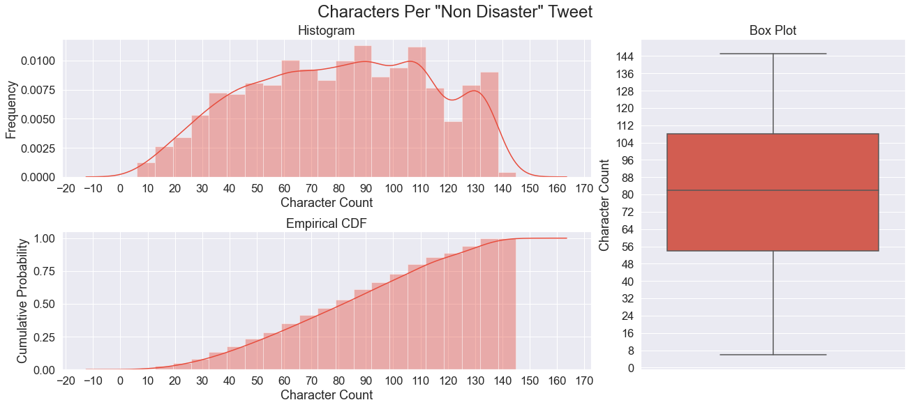
    


```python
plot_dist3(trainv[trainv['target'] == 1], 'Character Count',
           'Characters Per "Disaster" Tweet')
```


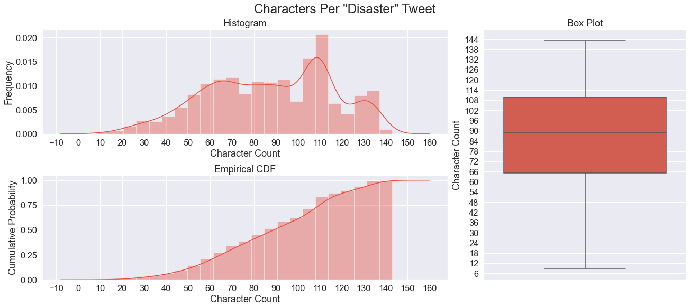
    


```python
def plot_word_number_histogram(textno, textye):
    
    """A function for comparing word counts"""

    fig, axes = plt.subplots(ncols=2, nrows=1, figsize=(18, 6), sharey=True)
    sns.distplot(textno.str.split().map(lambda x: len(x)), ax=axes[0], color='#e74c3c')
    sns.distplot(textye.str.split().map(lambda x: len(x)), ax=axes[1], color='#e74c3c')
    
    axes[0].set_xlabel('Word Count')
    axes[0].set_ylabel('Frequency')
    axes[0].set_title('Non Disaster Tweets')
    axes[1].set_xlabel('Word Count')
    axes[1].set_title('Disaster Tweets')
    
    fig.suptitle('Words Per Tweet', fontsize=24, va='baseline')
    
    fig.tight_layout()

```


```python
plot_word_number_histogram(trainv[trainv['target'] == 0]['text'],
                           trainv[trainv['target'] == 1]['text'])
```


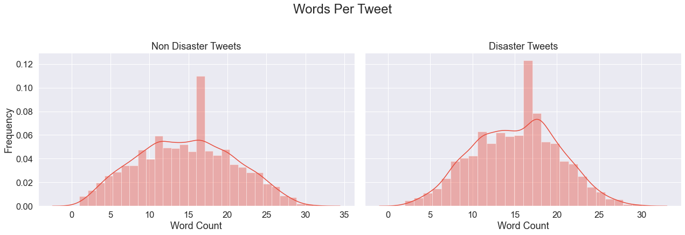
    


```python
def plot_word_len_histogram(textno, textye):
    
    """A function for comparing average word length"""
    
    fig, axes = plt.subplots(ncols=2, nrows=1, figsize=(18, 6), sharey=True)
    sns.distplot(textno.str.split().apply(lambda x: [len(i) for i in x]).map(
        lambda x: np.mean(x)),
                 ax=axes[0], color='#e74c3c')
    sns.distplot(textye.str.split().apply(lambda x: [len(i) for i in x]).map(
        lambda x: np.mean(x)),
                 ax=axes[1], color='#e74c3c')
    
    axes[0].set_xlabel('Word Length')
    axes[0].set_ylabel('Frequency')
    axes[0].set_title('Non Disaster Tweets')
    axes[1].set_xlabel('Word Length')
    axes[1].set_title('Disaster Tweets')
    
    fig.suptitle('Mean Word Lengths', fontsize=24, va='baseline')
    fig.tight_layout()
```


```python
plot_word_len_histogram(trainv[trainv['target'] == 0]['text'],
                        trainv[trainv['target'] == 1]['text'])
```


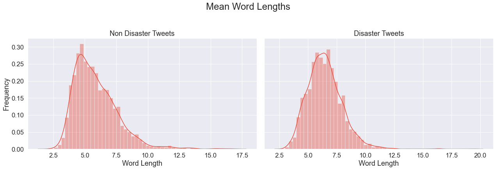
    


```python
lis = [
    trainv[trainv['target'] == 0]['lemma_str'],
    trainv[trainv['target'] == 1]['lemma_str']
]
```


```python
fig, axes = plt.subplots(1, 2, figsize=(18, 8))
axes = axes.flatten()

for i, j in zip(lis, axes):
    try:
        new = i.str.split()
        new = new.values.tolist()
        corpus = [word.lower() for i in new for word in i]
        dic = defaultdict(int)
        for word in corpus:
            if word in stop:
                dic[word] += 1

        top = sorted(dic.items(), key=lambda x: x[1], reverse=True)[:15]
        x, y = zip(*top)
        df = pd.DataFrame([x, y]).T
        df = df.rename(columns={0: 'Stopword', 1: 'Count'})
        sns.barplot(x='Count', y='Stopword', data=df, palette='plasma', ax=j)
        plt.tight_layout()
    except:
        plt.close()
        print('No stopwords left in texts.')
        break
```

    No stopwords left in texts.


```python
# Displaying most common words.

fig, axes = plt.subplots(1, 2, figsize=(18, 8))
axes = axes.flatten()

for i, j in zip(lis, axes):

    new = i.str.split()
    new = new.values.tolist()
    corpus = [word for i in new for word in i]

    counter = Counter(corpus)
    most = counter.most_common()
    x, y = [], []
    for word, count in most[:30]:
        if (word not in stop):
            x.append(word)
            y.append(count)

    sns.barplot(x=y, y=x, palette='plasma', ax=j)
axes[0].set_title('Non Disaster Tweets')

axes[1].set_title('Disaster Tweets')
axes[0].set_xlabel('Count')
axes[0].set_ylabel('Word')
axes[1].set_xlabel('Count')
axes[1].set_ylabel('Word')

fig.suptitle('Most Common Unigrams', fontsize=24, va='baseline')
plt.tight_layout()
```


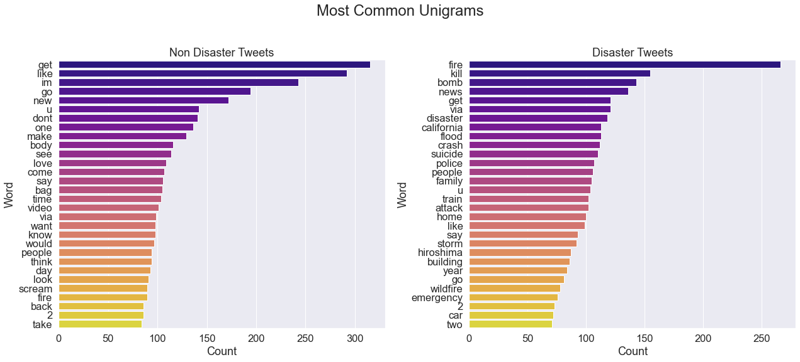
    


```python
def ngrams(n, title):
    """A Function to plot most common ngrams"""
    fig, axes = plt.subplots(1, 2, figsize=(18, 8))
    axes = axes.flatten()
    for i, j in zip(lis, axes):

        new = i.str.split()
        new = new.values.tolist()
        corpus = [word for i in new for word in i]

        def _get_top_ngram(corpus, n=None):
            #getting top ngrams
            vec = CountVectorizer(ngram_range=(n, n),
                                  max_df=0.9,
                                  stop_words='english').fit(corpus)
            bag_of_words = vec.transform(corpus)
            sum_words = bag_of_words.sum(axis=0)
            words_freq = [(word, sum_words[0, idx])
                          for word, idx in vec.vocabulary_.items()]
            words_freq = sorted(words_freq, key=lambda x: x[1], reverse=True)
            return words_freq[:15]

        top_n_bigrams = _get_top_ngram(i, n)[:15]
        x, y = map(list, zip(*top_n_bigrams))
        sns.barplot(x=y, y=x, palette='plasma', ax=j)
        
        axes[0].set_title('Non Disaster Tweets')
        axes[1].set_title('Disaster Tweets')
        axes[0].set_xlabel('Count')
        axes[0].set_ylabel('Words')
        axes[1].set_xlabel('Count')
        axes[1].set_ylabel('Words')
        fig.suptitle(title, fontsize=24, va='baseline')
        plt.tight_layout()
```


```python
ngrams(2, 'Most Common Bigrams')
```


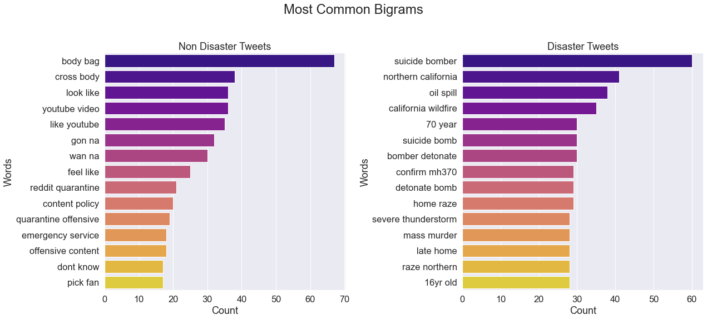
    


```python
ngrams(3, 'Most Common Bigrams')
```


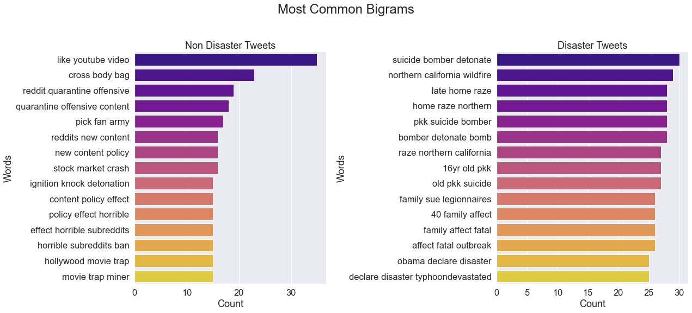
    


```python
def display_topics(text, no_top_words, topic):
    
    """ A function for determining the topics present in our corpus with nmf """
    
    no_top_words = no_top_words
    tfidf_vectorizer = TfidfVectorizer(
        max_df=0.90, min_df=25, max_features=5000, use_idf=True)
    tfidf = tfidf_vectorizer.fit_transform(text)
    tfidf_feature_names = tfidf_vectorizer.get_feature_names()
    doc_term_matrix_tfidf = pd.DataFrame(
        tfidf.toarray(), columns=list(tfidf_feature_names))
    nmf = NMF(n_components=10, random_state=0,
              alpha=.1, init='nndsvd').fit(tfidf)
    print(topic)
    for topic_idx, topic in enumerate(nmf.components_):
        print('Topic %d:' % (topic_idx+1))
        print(' '.join([tfidf_feature_names[i]
                        for i in topic.argsort()[:-no_top_words - 1:-1]]))


display_topics(lis[0], 10, 'Non Disaster Topics\n')
```

    Non Disaster Topics
    
    Topic 1:
    get lol blow good bomb first day demolish someone play
    Topic 2:
    like video youtube look feel back fire fatality sink mudslide
    Topic 3:
    im traumatise still disaster na gon attack drown dead weapon
    Topic 4:
    new emergency full read content post quarantine many storm re
    Topic 5:
    body bag cross shoulder woman full lady read ebay really
    Topic 6:
    dont one see know come say make want think fire
    Topic 7:
    scream fuck phone face good song loud hit baby time
    Topic 8:
    via youtube god change obliteration news story stop service video
    Topic 9:
    go content quarantine many explode make reddit let top deluge
    Topic 10:
    love crush collide woman much death military armageddon would check


```python
display_topics(lis[1], 10,'Disaster Topics\n')
```

    Disaster Topics
    
    Topic 1:
    fire forest building truck evacuate wild burn california service set
    Topic 2:
    suicide bomb kill bomber saudi mosque detonate pkk old 16yr
    Topic 3:
    california wildfire home northern late news raze abc collapse burn
    Topic 4:
    flood storm rain people train issue severe weather rescue violent
    Topic 5:
    hiroshima atomic bomb year japan still anniversary 70 war bombing
    Topic 6:
    via attack wave israeli police evacuation heat post wound car
    Topic 7:
    mh370 family confirm malaysia wreckage pm debris conclusively investigator find
    Topic 8:
    disaster nuclear obama natural declare saipan typhoondevastated sign collapse northern
    Topic 9:
    crash kill accident helicopter air train fear say police car
    Topic 10:
    get watch minute sandstorm swallow airport go im like dont


```python
mask = np.array(Image.open('./twitter.jpeg'))
mask[mask.sum(axis=2) == 0] = 255
```


```python
def plot_wordcloud(text, title, title_size):
    """ A function for creating wordcloud images """
    words = text
    allwords = []
    for wordlist in words:
        allwords += wordlist
    mostcommon = FreqDist(allwords).most_common(140)
    wordcloud = WordCloud(
        width=1200,
        height=800,
        background_color='black',
        stopwords=set(STOPWORDS),
        max_words=150,
        scale=3,
        mask=mask,
        contour_width=0.1,
        contour_color='grey',
    ).generate(str(mostcommon))    

    def grey_color_func(word,
                        font_size,
                        position,
                        orientation,
                        random_state=None,
                        **kwargs):
        # A definition for creating grey color shades.
        return 'hsl(0, 0%%, %d%%)' % random.randint(60, 100)

    fig = plt.figure(figsize=(18, 18), facecolor='white')
    plt.imshow(wordcloud.recolor(color_func=grey_color_func, random_state=42),
               interpolation='bilinear')
    plt.axis('off')
    plt.title(title,
              fontdict={
                  'size': title_size,
                  'verticalalignment': 'bottom'
              })
    plt.tight_layout(pad=0)
    plt.show()
```


```python
plot_wordcloud(trainv[trainv['target'] == 0]['lemmatized'],
               'Most Common Words in Non-Disaster Tweets',
               title_size=30)
```


    


```python
plot_wordcloud(trainv[trainv['target'] == 1]['lemmatized'],
               'Most Common Words in Disaster Tweets',
               title_size=30)
```


    


```python
# Loading NER.
nlp = en_core_web_sm.load()
```


```python
def plot_named_entity_barchart(text):
    
    """A function for extracting named entities and comparing them"""
    
    def _get_ner(text):
        doc = nlp(text)
        return [X.label_ for X in doc.ents]

    ent = text.apply(lambda x: _get_ner(x))
    ent = [x for sub in ent for x in sub]
    counter = Counter(ent)
    count = counter.most_common()

    x, y = map(list, zip(*count))
    sns.barplot(x=y, y=x)
```


```python
fig, axes = plt.subplots(1, 2, figsize=(18, 8))
axes = axes.flatten()
for i, j in zip(lis, axes):

    def _get_ner(i):
        doc = nlp(i)
        return [X.label_ for X in doc.ents]

    ent = i.apply(lambda x: _get_ner(x))
    ent = [x for sub in ent for x in sub]
    counter = Counter(ent)
    count = counter.most_common()[:15]

    x, y = map(list, zip(*count))
    sns.barplot(x=y, y=x, ax=j, palette='plasma')

axes[0].set_title('Non Disaster Tweets')
axes[1].set_title('Disaster Tweets')
axes[0].set_xlabel('Count')
axes[0].set_ylabel('Named-Entity')
axes[1].set_xlabel('Count')
axes[1].set_ylabel('Named-Entity')
fig.suptitle('Common Named-Entity Counts', fontsize=24, va='baseline')


patch1 = mpatches.Patch(label='PERSON : People, including fictional')
patch2 = mpatches.Patch(label='ORG : Companies, agencies, institutions, etc.')
patch3 = mpatches.Patch(label='CARDINAL : Numerals that dont fall under another type.')
patch4 = mpatches.Patch(label='GPE : Countries, cities, states.')
patch5 = mpatches.Patch(label='NORP : Nationalities or religious or political groups.')
patch6 = mpatches.Patch(label='TIME : Times smaller than a day.')
patch7 = mpatches.Patch(label='QUANTITY : Measurements, as of weight or distance.')
patch8 = mpatches.Patch(label='ORDINAL : “first”, “second”, etc.')
patch9 = mpatches.Patch(label='LOC : Non-GPE locations, mountain ranges, bodies of water.')
patch10 = mpatches.Patch(label='FAC : Buildings, airports, highways, bridges, etc.')
patch11 = mpatches.Patch(label='PRODUCT : Objects, vehicles, foods, etc. (Not services.)')
patch12 = mpatches.Patch(label='EVENT : Named hurricanes, battles, wars, sports events, etc.')
patch13 = mpatches.Patch(label='LANGUAGE : Any named language.')
patch14 = mpatches.Patch(label='PERCENT : Percentage, including ”%“.')
patch15 = mpatches.Patch(label='DATE : Absolute or relative dates or periods.')


plt.legend(handles=[patch1, patch2, patch3, patch4, patch5, patch6, patch7, patch8, patch9, patch10, patch11, patch12, patch13, patch14, patch15, ],bbox_to_anchor=(1.05, 0.85), loc='upper left', borderaxespad=0.)

plt.show()
```


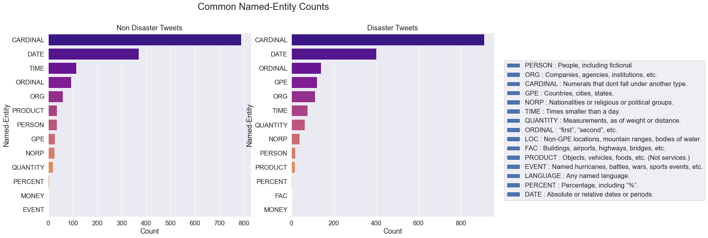
    


```python
if not torch.backends.mps.is_available():
    if not torch.backends.mps.is_built():
        print("MPS not available because the current PyTorch install was not "
              "built with MPS enabled.")
        print('No GPU available, using the CPU instead.')
        device = torch.device('cpu')
    else:
        print("MPS not available because the current MacOS version is not 12.3+ "
              "and/or you do not have an MPS-enabled device on this machine.")
        print('No GPU available, using the CPU instead.')
        device = torch.device('cpu')

else:
    print('GPU is available.')
    device = torch.device('mps')
```

    GPU is available.


```python
train = pd.read_csv('./train.csv')
test = pd.read_csv('./test.csv')

print(f'Number of training tweets: {train.shape[0]}\n')
print(f'Number of training tweets: {test.shape[0]}\n')

display(train.sample(10))
```

    Number of training tweets: 7613
    
    Number of training tweets: 3263


<div>
<style scoped>
    .dataframe tbody tr th:only-of-type {
        vertical-align: middle;
    }

    .dataframe tbody tr th {
        vertical-align: top;
    }
    
    .dataframe thead th {
        text-align: right;
    }
</style>
<table border="1" class="dataframe">
  <thead>
    <tr style="text-align: right;">
      <th></th>
      <th>id</th>
      <th>keyword</th>
      <th>location</th>
      <th>text</th>
      <th>target</th>
    </tr>
  </thead>
  <tbody>
    <tr>
      <th>217</th>
      <td>309</td>
      <td>annihilated</td>
      <td>Greater Manchester, UK</td>
      <td>@ACarewornHeart Have a good un fella sorry I w...</td>
      <td>0</td>
    </tr>
    <tr>
      <th>6688</th>
      <td>9582</td>
      <td>thunder</td>
      <td>NaN</td>
      <td>Thunder lightening torrential rain and a power...</td>
      <td>1</td>
    </tr>
    <tr>
      <th>2687</th>
      <td>3855</td>
      <td>detonation</td>
      <td>NaN</td>
      <td>Dorman 917-033 Ignition Knock (Detonation) Sen...</td>
      <td>1</td>
    </tr>
    <tr>
      <th>5060</th>
      <td>7211</td>
      <td>natural%20disaster</td>
      <td>lia‰Û¢dani‰Û¢laura</td>
      <td>Rise up like a natural disaster we take the ba...</td>
      <td>0</td>
    </tr>
    <tr>
      <th>6855</th>
      <td>9826</td>
      <td>trauma</td>
      <td>NaN</td>
      <td>Trauma injuries involving kids and sport usual...</td>
      <td>1</td>
    </tr>
    <tr>
      <th>563</th>
      <td>814</td>
      <td>battle</td>
      <td>NaN</td>
      <td>A young German stormtrooper engaged in the Bat...</td>
      <td>1</td>
    </tr>
    <tr>
      <th>2431</th>
      <td>3493</td>
      <td>derailed</td>
      <td>United Kingdom</td>
      <td>#tubestrike derailed you? Our #robertwelch cut...</td>
      <td>0</td>
    </tr>
    <tr>
      <th>2928</th>
      <td>4209</td>
      <td>drowned</td>
      <td>NaN</td>
      <td>@ABCNews24 @PeterDutton_MP \nHe also told you....</td>
      <td>0</td>
    </tr>
    <tr>
      <th>3400</th>
      <td>4868</td>
      <td>explode</td>
      <td>London / Berlin / Online</td>
      <td>'I eat because it makes my mouth explode with ...</td>
      <td>0</td>
    </tr>
    <tr>
      <th>6258</th>
      <td>8942</td>
      <td>storm</td>
      <td>NaN</td>
      <td>FINALLY a storm</td>
      <td>0</td>
    </tr>
  </tbody>
</table>
</div>


```python
# Setting target variables, creating combined data and saving index for dividing combined data later.

labels = train['target'].values
idx = len(labels)
combined = pd.concat([train, test])
combined = combined.text.values
```


```python
tokenizer = BertTokenizer.from_pretrained('bert-large-uncased', do_lower_case=True)
```


```python
# Print the original tweet.

print(' Original: ', combined[0])

# Print the tweet split into tokens.

print('Tokenized: ', tokenizer.tokenize(combined[0]))

# Print the sentence mapped to token ID's.

print('Token IDs: ', tokenizer.convert_tokens_to_ids(tokenizer.tokenize(combined[0])))
```

     Original:  Our Deeds are the Reason of this #earthquake May ALLAH Forgive us all
    Tokenized:  ['our', 'deeds', 'are', 'the', 'reason', 'of', 'this', '#', 'earthquake', 'may', 'allah', 'forgive', 'us', 'all']
    Token IDs:  [2256, 15616, 2024, 1996, 3114, 1997, 2023, 1001, 8372, 2089, 16455, 9641, 2149, 2035]


```python
max_len = 0

# For every sentence...

for text in combined:

    # Tokenize the text and add `[CLS]` and `[SEP]` tokens.
    
    input_ids = tokenizer.encode(text, add_special_tokens=True)

    # Update the maximum sentence length.
    
    max_len = max(max_len, len(input_ids))

print('Max sentence length: ', max_len)
```

    Max sentence length:  84


```python
# Making list of sentence lenghts:

token_lens = []

for text in combined:
    tokens = tokenizer.encode(text, max_length = 512)
    token_lens.append(len(tokens))
```

    Truncation was not explicitly activated but `max_length` is provided a specific value, please use `truncation=True` to explicitly truncate examples to max length. Defaulting to 'longest_first' truncation strategy. If you encode pairs of sequences (GLUE-style) with the tokenizer you can select this strategy more precisely by providing a specific strategy to `truncation`.


```python
fig, axes = plt.subplots(figsize=(14, 6))
sns.distplot(token_lens, color='#e74c3c')
plt.show()
```


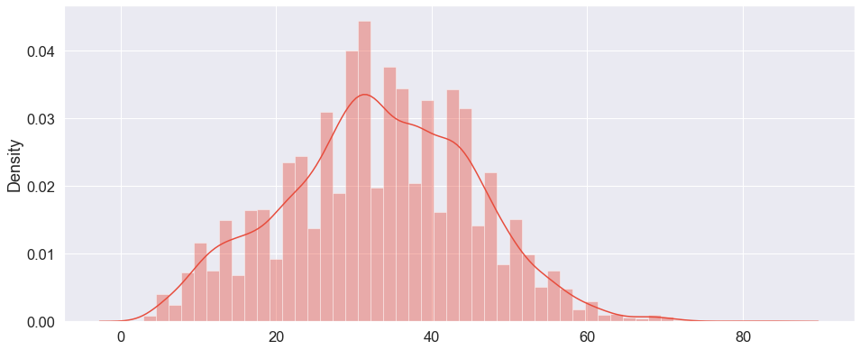
    


```python
# Splitting the train test data after tokenizing.

train= combined[:idx]
test = combined[idx:]
train.shape

```


    (7613,)


```python
def tokenize_map(sentence,labs='None'):
    
    """A function for tokenize all of the sentences and map the tokens to their word IDs."""
    
    global labels
    
    input_ids = []
    attention_masks = []

    # For every sentence...
    
    for text in sentence:
        #   "encode_plus" will:
        
        #   (1) Tokenize the sentence.
        #   (2) Prepend the `[CLS]` token to the start.
        #   (3) Append the `[SEP]` token to the end.
        #   (4) Map tokens to their IDs.
        #   (5) Pad or truncate the sentence to `max_length`
        #   (6) Create attention masks for [PAD] tokens.
        
        encoded_dict = tokenizer.encode_plus(
                            text,                      # Sentence to encode.
                            add_special_tokens = True, # Add '[CLS]' and '[SEP]'
                            truncation='longest_first', # Activate and control truncation
                            max_length = 84,           # Max length according to our text data.
                            pad_to_max_length = True, # Pad & truncate all sentences.
                            return_attention_mask = True,   # Construct attn. masks.
                            return_tensors = 'pt',     # Return pytorch tensors.
                       )

        # Add the encoded sentence to the id list. 
        
        input_ids.append(encoded_dict['input_ids'])

        # And its attention mask (simply differentiates padding from non-padding).
        
        attention_masks.append(encoded_dict['attention_mask'])

    # Convert the lists into tensors.
    
    input_ids = torch.cat(input_ids, dim=0)
    attention_masks = torch.cat(attention_masks, dim=0)
    
    if labs != 'None': # Setting this for using this definition for both train and test data so labels won't be a problem in our outputs.
        labels = torch.tensor(labels)
        return input_ids, attention_masks, labels
    else:
        return input_ids, attention_masks

```


```python
# Tokenizing all of the train test sentences and mapping the tokens to their word IDs.

input_ids, attention_masks, labels = tokenize_map(train, labels)
test_input_ids, test_attention_masks= tokenize_map(test)
```


```python
# Combine the training inputs into a TensorDataset.

dataset = TensorDataset(input_ids, attention_masks, labels)

# Create a 80-20 train-validation split.

# Calculate the number of samples to include in each set.

train_size = int(0.8 * len(dataset))
val_size = len(dataset) - train_size

# Divide the dataset by randomly selecting samples.

train_dataset, val_dataset = random_split(dataset, [train_size, val_size])

print('{:>5,} training samples'.format(train_size))
print('{:>5,} validation samples'.format(val_size))
```

    6,090 training samples
    1,523 validation samples


```python
# The DataLoader needs to know our batch size for training, so we specify it here. For fine-tuning BERT on a specific task, the authors recommend a batch size of 16 or 32.

batch_size = 32

# Create the DataLoaders for our training and validation sets.
# We'll take training samples in random order. 

train_dataloader = DataLoader(
            train_dataset,  # The training samples.
            sampler = RandomSampler(train_dataset), # Select batches randomly
            batch_size = batch_size # Trains with this batch size.
        )

# For validation the order doesn't matter, so we'll just read them sequentially.

validation_dataloader = DataLoader(
            val_dataset, # The validation samples.
            sampler = SequentialSampler(val_dataset), # Pull out batches sequentially.
            batch_size = batch_size # Evaluate with this batch size.
        )
```


```python
prediction_data = TensorDataset(test_input_ids, test_attention_masks)
prediction_sampler = SequentialSampler(prediction_data)
prediction_dataloader = DataLoader(prediction_data, sampler=prediction_sampler, batch_size=batch_size)
```


```python
# Load BertForSequenceClassification, the pretrained BERT model with a single linear classification layer on top. 

model = BertForSequenceClassification.from_pretrained(
    'bert-large-uncased', # Use the 124-layer, 1024-hidden, 16-heads, 340M parameters BERT model with an uncased vocab.
    num_labels = 2, # The number of output labels--2 for binary classification. You can increase this for multi-class tasks.   
    output_attentions = False, # Whether the model returns attentions weights.
    output_hidden_states = False, # Whether the model returns all hidden-states.
)

# Tell pytorch to run this model on the device which we set GPU in our case.

model.to(device)
```

    Some weights of the model checkpoint at bert-large-uncased were not used when initializing BertForSequenceClassification: ['cls.seq_relationship.weight', 'cls.predictions.transform.dense.weight', 'cls.seq_relationship.bias', 'cls.predictions.transform.dense.bias', 'cls.predictions.transform.LayerNorm.bias', 'cls.predictions.transform.LayerNorm.weight', 'cls.predictions.bias', 'cls.predictions.decoder.weight']
    - This IS expected if you are initializing BertForSequenceClassification from the checkpoint of a model trained on another task or with another architecture (e.g. initializing a BertForSequenceClassification model from a BertForPreTraining model).
    - This IS NOT expected if you are initializing BertForSequenceClassification from the checkpoint of a model that you expect to be exactly identical (initializing a BertForSequenceClassification model from a BertForSequenceClassification model).
    Some weights of BertForSequenceClassification were not initialized from the model checkpoint at bert-large-uncased and are newly initialized: ['classifier.weight', 'classifier.bias']
    You should probably TRAIN this model on a down-stream task to be able to use it for predictions and inference.


    BertForSequenceClassification(
      (bert): BertModel(
        (embeddings): BertEmbeddings(
          (word_embeddings): Embedding(30522, 1024, padding_idx=0)
          (position_embeddings): Embedding(512, 1024)
          (token_type_embeddings): Embedding(2, 1024)
          (LayerNorm): LayerNorm((1024,), eps=1e-12, elementwise_affine=True)
          (dropout): Dropout(p=0.1, inplace=False)
        )
        (encoder): BertEncoder(
          (layer): ModuleList(
            (0): BertLayer(
              (attention): BertAttention(
                (self): BertSelfAttention(
                  (query): Linear(in_features=1024, out_features=1024, bias=True)
                  (key): Linear(in_features=1024, out_features=1024, bias=True)
                  (value): Linear(in_features=1024, out_features=1024, bias=True)
                  (dropout): Dropout(p=0.1, inplace=False)
                )
                (output): BertSelfOutput(
                  (dense): Linear(in_features=1024, out_features=1024, bias=True)
                  (LayerNorm): LayerNorm((1024,), eps=1e-12, elementwise_affine=True)
                  (dropout): Dropout(p=0.1, inplace=False)
                )
              )
              (intermediate): BertIntermediate(
                (dense): Linear(in_features=1024, out_features=4096, bias=True)
                (intermediate_act_fn): GELUActivation()
              )
              (output): BertOutput(
                (dense): Linear(in_features=4096, out_features=1024, bias=True)
                (LayerNorm): LayerNorm((1024,), eps=1e-12, elementwise_affine=True)
                (dropout): Dropout(p=0.1, inplace=False)
              )
            )
            (1): BertLayer(
              (attention): BertAttention(
                (self): BertSelfAttention(
                  (query): Linear(in_features=1024, out_features=1024, bias=True)
                  (key): Linear(in_features=1024, out_features=1024, bias=True)
                  (value): Linear(in_features=1024, out_features=1024, bias=True)
                  (dropout): Dropout(p=0.1, inplace=False)
                )
                (output): BertSelfOutput(
                  (dense): Linear(in_features=1024, out_features=1024, bias=True)
                  (LayerNorm): LayerNorm((1024,), eps=1e-12, elementwise_affine=True)
                  (dropout): Dropout(p=0.1, inplace=False)
                )
              )
              (intermediate): BertIntermediate(
                (dense): Linear(in_features=1024, out_features=4096, bias=True)
                (intermediate_act_fn): GELUActivation()
              )
              (output): BertOutput(
                (dense): Linear(in_features=4096, out_features=1024, bias=True)
                (LayerNorm): LayerNorm((1024,), eps=1e-12, elementwise_affine=True)
                (dropout): Dropout(p=0.1, inplace=False)
              )
            )
            (2): BertLayer(
              (attention): BertAttention(
                (self): BertSelfAttention(
                  (query): Linear(in_features=1024, out_features=1024, bias=True)
                  (key): Linear(in_features=1024, out_features=1024, bias=True)
                  (value): Linear(in_features=1024, out_features=1024, bias=True)
                  (dropout): Dropout(p=0.1, inplace=False)
                )
                (output): BertSelfOutput(
                  (dense): Linear(in_features=1024, out_features=1024, bias=True)
                  (LayerNorm): LayerNorm((1024,), eps=1e-12, elementwise_affine=True)
                  (dropout): Dropout(p=0.1, inplace=False)
                )
              )
              (intermediate): BertIntermediate(
                (dense): Linear(in_features=1024, out_features=4096, bias=True)
                (intermediate_act_fn): GELUActivation()
              )
              (output): BertOutput(
                (dense): Linear(in_features=4096, out_features=1024, bias=True)
                (LayerNorm): LayerNorm((1024,), eps=1e-12, elementwise_affine=True)
                (dropout): Dropout(p=0.1, inplace=False)
              )
            )
            (3): BertLayer(
              (attention): BertAttention(
                (self): BertSelfAttention(
                  (query): Linear(in_features=1024, out_features=1024, bias=True)
                  (key): Linear(in_features=1024, out_features=1024, bias=True)
                  (value): Linear(in_features=1024, out_features=1024, bias=True)
                  (dropout): Dropout(p=0.1, inplace=False)
                )
                (output): BertSelfOutput(
                  (dense): Linear(in_features=1024, out_features=1024, bias=True)
                  (LayerNorm): LayerNorm((1024,), eps=1e-12, elementwise_affine=True)
                  (dropout): Dropout(p=0.1, inplace=False)
                )
              )
              (intermediate): BertIntermediate(
                (dense): Linear(in_features=1024, out_features=4096, bias=True)
                (intermediate_act_fn): GELUActivation()
              )
              (output): BertOutput(
                (dense): Linear(in_features=4096, out_features=1024, bias=True)
                (LayerNorm): LayerNorm((1024,), eps=1e-12, elementwise_affine=True)
                (dropout): Dropout(p=0.1, inplace=False)
              )
            )
            (4): BertLayer(
              (attention): BertAttention(
                (self): BertSelfAttention(
                  (query): Linear(in_features=1024, out_features=1024, bias=True)
                  (key): Linear(in_features=1024, out_features=1024, bias=True)
                  (value): Linear(in_features=1024, out_features=1024, bias=True)
                  (dropout): Dropout(p=0.1, inplace=False)
                )
                (output): BertSelfOutput(
                  (dense): Linear(in_features=1024, out_features=1024, bias=True)
                  (LayerNorm): LayerNorm((1024,), eps=1e-12, elementwise_affine=True)
                  (dropout): Dropout(p=0.1, inplace=False)
                )
              )
              (intermediate): BertIntermediate(
                (dense): Linear(in_features=1024, out_features=4096, bias=True)
                (intermediate_act_fn): GELUActivation()
              )
              (output): BertOutput(
                (dense): Linear(in_features=4096, out_features=1024, bias=True)
                (LayerNorm): LayerNorm((1024,), eps=1e-12, elementwise_affine=True)
                (dropout): Dropout(p=0.1, inplace=False)
              )
            )
            (5): BertLayer(
              (attention): BertAttention(
                (self): BertSelfAttention(
                  (query): Linear(in_features=1024, out_features=1024, bias=True)
                  (key): Linear(in_features=1024, out_features=1024, bias=True)
                  (value): Linear(in_features=1024, out_features=1024, bias=True)
                  (dropout): Dropout(p=0.1, inplace=False)
                )
                (output): BertSelfOutput(
                  (dense): Linear(in_features=1024, out_features=1024, bias=True)
                  (LayerNorm): LayerNorm((1024,), eps=1e-12, elementwise_affine=True)
                  (dropout): Dropout(p=0.1, inplace=False)
                )
              )
              (intermediate): BertIntermediate(
                (dense): Linear(in_features=1024, out_features=4096, bias=True)
                (intermediate_act_fn): GELUActivation()
              )
              (output): BertOutput(
                (dense): Linear(in_features=4096, out_features=1024, bias=True)
                (LayerNorm): LayerNorm((1024,), eps=1e-12, elementwise_affine=True)
                (dropout): Dropout(p=0.1, inplace=False)
              )
            )
            (6): BertLayer(
              (attention): BertAttention(
                (self): BertSelfAttention(
                  (query): Linear(in_features=1024, out_features=1024, bias=True)
                  (key): Linear(in_features=1024, out_features=1024, bias=True)
                  (value): Linear(in_features=1024, out_features=1024, bias=True)
                  (dropout): Dropout(p=0.1, inplace=False)
                )
                (output): BertSelfOutput(
                  (dense): Linear(in_features=1024, out_features=1024, bias=True)
                  (LayerNorm): LayerNorm((1024,), eps=1e-12, elementwise_affine=True)
                  (dropout): Dropout(p=0.1, inplace=False)
                )
              )
              (intermediate): BertIntermediate(
                (dense): Linear(in_features=1024, out_features=4096, bias=True)
                (intermediate_act_fn): GELUActivation()
              )
              (output): BertOutput(
                (dense): Linear(in_features=4096, out_features=1024, bias=True)
                (LayerNorm): LayerNorm((1024,), eps=1e-12, elementwise_affine=True)
                (dropout): Dropout(p=0.1, inplace=False)
              )
            )
            (7): BertLayer(
              (attention): BertAttention(
                (self): BertSelfAttention(
                  (query): Linear(in_features=1024, out_features=1024, bias=True)
                  (key): Linear(in_features=1024, out_features=1024, bias=True)
                  (value): Linear(in_features=1024, out_features=1024, bias=True)
                  (dropout): Dropout(p=0.1, inplace=False)
                )
                (output): BertSelfOutput(
                  (dense): Linear(in_features=1024, out_features=1024, bias=True)
                  (LayerNorm): LayerNorm((1024,), eps=1e-12, elementwise_affine=True)
                  (dropout): Dropout(p=0.1, inplace=False)
                )
              )
              (intermediate): BertIntermediate(
                (dense): Linear(in_features=1024, out_features=4096, bias=True)
                (intermediate_act_fn): GELUActivation()
              )
              (output): BertOutput(
                (dense): Linear(in_features=4096, out_features=1024, bias=True)
                (LayerNorm): LayerNorm((1024,), eps=1e-12, elementwise_affine=True)
                (dropout): Dropout(p=0.1, inplace=False)
              )
            )
            (8): BertLayer(
              (attention): BertAttention(
                (self): BertSelfAttention(
                  (query): Linear(in_features=1024, out_features=1024, bias=True)
                  (key): Linear(in_features=1024, out_features=1024, bias=True)
                  (value): Linear(in_features=1024, out_features=1024, bias=True)
                  (dropout): Dropout(p=0.1, inplace=False)
                )
                (output): BertSelfOutput(
                  (dense): Linear(in_features=1024, out_features=1024, bias=True)
                  (LayerNorm): LayerNorm((1024,), eps=1e-12, elementwise_affine=True)
                  (dropout): Dropout(p=0.1, inplace=False)
                )
              )
              (intermediate): BertIntermediate(
                (dense): Linear(in_features=1024, out_features=4096, bias=True)
                (intermediate_act_fn): GELUActivation()
              )
              (output): BertOutput(
                (dense): Linear(in_features=4096, out_features=1024, bias=True)
                (LayerNorm): LayerNorm((1024,), eps=1e-12, elementwise_affine=True)
                (dropout): Dropout(p=0.1, inplace=False)
              )
            )
            (9): BertLayer(
              (attention): BertAttention(
                (self): BertSelfAttention(
                  (query): Linear(in_features=1024, out_features=1024, bias=True)
                  (key): Linear(in_features=1024, out_features=1024, bias=True)
                  (value): Linear(in_features=1024, out_features=1024, bias=True)
                  (dropout): Dropout(p=0.1, inplace=False)
                )
                (output): BertSelfOutput(
                  (dense): Linear(in_features=1024, out_features=1024, bias=True)
                  (LayerNorm): LayerNorm((1024,), eps=1e-12, elementwise_affine=True)
                  (dropout): Dropout(p=0.1, inplace=False)
                )
              )
              (intermediate): BertIntermediate(
                (dense): Linear(in_features=1024, out_features=4096, bias=True)
                (intermediate_act_fn): GELUActivation()
              )
              (output): BertOutput(
                (dense): Linear(in_features=4096, out_features=1024, bias=True)
                (LayerNorm): LayerNorm((1024,), eps=1e-12, elementwise_affine=True)
                (dropout): Dropout(p=0.1, inplace=False)
              )
            )
            (10): BertLayer(
              (attention): BertAttention(
                (self): BertSelfAttention(
                  (query): Linear(in_features=1024, out_features=1024, bias=True)
                  (key): Linear(in_features=1024, out_features=1024, bias=True)
                  (value): Linear(in_features=1024, out_features=1024, bias=True)
                  (dropout): Dropout(p=0.1, inplace=False)
                )
                (output): BertSelfOutput(
                  (dense): Linear(in_features=1024, out_features=1024, bias=True)
                  (LayerNorm): LayerNorm((1024,), eps=1e-12, elementwise_affine=True)
                  (dropout): Dropout(p=0.1, inplace=False)
                )
              )
              (intermediate): BertIntermediate(
                (dense): Linear(in_features=1024, out_features=4096, bias=True)
                (intermediate_act_fn): GELUActivation()
              )
              (output): BertOutput(
                (dense): Linear(in_features=4096, out_features=1024, bias=True)
                (LayerNorm): LayerNorm((1024,), eps=1e-12, elementwise_affine=True)
                (dropout): Dropout(p=0.1, inplace=False)
              )
            )
            (11): BertLayer(
              (attention): BertAttention(
                (self): BertSelfAttention(
                  (query): Linear(in_features=1024, out_features=1024, bias=True)
                  (key): Linear(in_features=1024, out_features=1024, bias=True)
                  (value): Linear(in_features=1024, out_features=1024, bias=True)
                  (dropout): Dropout(p=0.1, inplace=False)
                )
                (output): BertSelfOutput(
                  (dense): Linear(in_features=1024, out_features=1024, bias=True)
                  (LayerNorm): LayerNorm((1024,), eps=1e-12, elementwise_affine=True)
                  (dropout): Dropout(p=0.1, inplace=False)
                )
              )
              (intermediate): BertIntermediate(
                (dense): Linear(in_features=1024, out_features=4096, bias=True)
                (intermediate_act_fn): GELUActivation()
              )
              (output): BertOutput(
                (dense): Linear(in_features=4096, out_features=1024, bias=True)
                (LayerNorm): LayerNorm((1024,), eps=1e-12, elementwise_affine=True)
                (dropout): Dropout(p=0.1, inplace=False)
              )
            )
            (12): BertLayer(
              (attention): BertAttention(
                (self): BertSelfAttention(
                  (query): Linear(in_features=1024, out_features=1024, bias=True)
                  (key): Linear(in_features=1024, out_features=1024, bias=True)
                  (value): Linear(in_features=1024, out_features=1024, bias=True)
                  (dropout): Dropout(p=0.1, inplace=False)
                )
                (output): BertSelfOutput(
                  (dense): Linear(in_features=1024, out_features=1024, bias=True)
                  (LayerNorm): LayerNorm((1024,), eps=1e-12, elementwise_affine=True)
                  (dropout): Dropout(p=0.1, inplace=False)
                )
              )
              (intermediate): BertIntermediate(
                (dense): Linear(in_features=1024, out_features=4096, bias=True)
                (intermediate_act_fn): GELUActivation()
              )
              (output): BertOutput(
                (dense): Linear(in_features=4096, out_features=1024, bias=True)
                (LayerNorm): LayerNorm((1024,), eps=1e-12, elementwise_affine=True)
                (dropout): Dropout(p=0.1, inplace=False)
              )
            )
            (13): BertLayer(
              (attention): BertAttention(
                (self): BertSelfAttention(
                  (query): Linear(in_features=1024, out_features=1024, bias=True)
                  (key): Linear(in_features=1024, out_features=1024, bias=True)
                  (value): Linear(in_features=1024, out_features=1024, bias=True)
                  (dropout): Dropout(p=0.1, inplace=False)
                )
                (output): BertSelfOutput(
                  (dense): Linear(in_features=1024, out_features=1024, bias=True)
                  (LayerNorm): LayerNorm((1024,), eps=1e-12, elementwise_affine=True)
                  (dropout): Dropout(p=0.1, inplace=False)
                )
              )
              (intermediate): BertIntermediate(
                (dense): Linear(in_features=1024, out_features=4096, bias=True)
                (intermediate_act_fn): GELUActivation()
              )
              (output): BertOutput(
                (dense): Linear(in_features=4096, out_features=1024, bias=True)
                (LayerNorm): LayerNorm((1024,), eps=1e-12, elementwise_affine=True)
                (dropout): Dropout(p=0.1, inplace=False)
              )
            )
            (14): BertLayer(
              (attention): BertAttention(
                (self): BertSelfAttention(
                  (query): Linear(in_features=1024, out_features=1024, bias=True)
                  (key): Linear(in_features=1024, out_features=1024, bias=True)
                  (value): Linear(in_features=1024, out_features=1024, bias=True)
                  (dropout): Dropout(p=0.1, inplace=False)
                )
                (output): BertSelfOutput(
                  (dense): Linear(in_features=1024, out_features=1024, bias=True)
                  (LayerNorm): LayerNorm((1024,), eps=1e-12, elementwise_affine=True)
                  (dropout): Dropout(p=0.1, inplace=False)
                )
              )
              (intermediate): BertIntermediate(
                (dense): Linear(in_features=1024, out_features=4096, bias=True)
                (intermediate_act_fn): GELUActivation()
              )
              (output): BertOutput(
                (dense): Linear(in_features=4096, out_features=1024, bias=True)
                (LayerNorm): LayerNorm((1024,), eps=1e-12, elementwise_affine=True)
                (dropout): Dropout(p=0.1, inplace=False)
              )
            )
            (15): BertLayer(
              (attention): BertAttention(
                (self): BertSelfAttention(
                  (query): Linear(in_features=1024, out_features=1024, bias=True)
                  (key): Linear(in_features=1024, out_features=1024, bias=True)
                  (value): Linear(in_features=1024, out_features=1024, bias=True)
                  (dropout): Dropout(p=0.1, inplace=False)
                )
                (output): BertSelfOutput(
                  (dense): Linear(in_features=1024, out_features=1024, bias=True)
                  (LayerNorm): LayerNorm((1024,), eps=1e-12, elementwise_affine=True)
                  (dropout): Dropout(p=0.1, inplace=False)
                )
              )
              (intermediate): BertIntermediate(
                (dense): Linear(in_features=1024, out_features=4096, bias=True)
                (intermediate_act_fn): GELUActivation()
              )
              (output): BertOutput(
                (dense): Linear(in_features=4096, out_features=1024, bias=True)
                (LayerNorm): LayerNorm((1024,), eps=1e-12, elementwise_affine=True)
                (dropout): Dropout(p=0.1, inplace=False)
              )
            )
            (16): BertLayer(
              (attention): BertAttention(
                (self): BertSelfAttention(
                  (query): Linear(in_features=1024, out_features=1024, bias=True)
                  (key): Linear(in_features=1024, out_features=1024, bias=True)
                  (value): Linear(in_features=1024, out_features=1024, bias=True)
                  (dropout): Dropout(p=0.1, inplace=False)
                )
                (output): BertSelfOutput(
                  (dense): Linear(in_features=1024, out_features=1024, bias=True)
                  (LayerNorm): LayerNorm((1024,), eps=1e-12, elementwise_affine=True)
                  (dropout): Dropout(p=0.1, inplace=False)
                )
              )
              (intermediate): BertIntermediate(
                (dense): Linear(in_features=1024, out_features=4096, bias=True)
                (intermediate_act_fn): GELUActivation()
              )
              (output): BertOutput(
                (dense): Linear(in_features=4096, out_features=1024, bias=True)
                (LayerNorm): LayerNorm((1024,), eps=1e-12, elementwise_affine=True)
                (dropout): Dropout(p=0.1, inplace=False)
              )
            )
            (17): BertLayer(
              (attention): BertAttention(
                (self): BertSelfAttention(
                  (query): Linear(in_features=1024, out_features=1024, bias=True)
                  (key): Linear(in_features=1024, out_features=1024, bias=True)
                  (value): Linear(in_features=1024, out_features=1024, bias=True)
                  (dropout): Dropout(p=0.1, inplace=False)
                )
                (output): BertSelfOutput(
                  (dense): Linear(in_features=1024, out_features=1024, bias=True)
                  (LayerNorm): LayerNorm((1024,), eps=1e-12, elementwise_affine=True)
                  (dropout): Dropout(p=0.1, inplace=False)
                )
              )
              (intermediate): BertIntermediate(
                (dense): Linear(in_features=1024, out_features=4096, bias=True)
                (intermediate_act_fn): GELUActivation()
              )
              (output): BertOutput(
                (dense): Linear(in_features=4096, out_features=1024, bias=True)
                (LayerNorm): LayerNorm((1024,), eps=1e-12, elementwise_affine=True)
                (dropout): Dropout(p=0.1, inplace=False)
              )
            )
            (18): BertLayer(
              (attention): BertAttention(
                (self): BertSelfAttention(
                  (query): Linear(in_features=1024, out_features=1024, bias=True)
                  (key): Linear(in_features=1024, out_features=1024, bias=True)
                  (value): Linear(in_features=1024, out_features=1024, bias=True)
                  (dropout): Dropout(p=0.1, inplace=False)
                )
                (output): BertSelfOutput(
                  (dense): Linear(in_features=1024, out_features=1024, bias=True)
                  (LayerNorm): LayerNorm((1024,), eps=1e-12, elementwise_affine=True)
                  (dropout): Dropout(p=0.1, inplace=False)
                )
              )
              (intermediate): BertIntermediate(
                (dense): Linear(in_features=1024, out_features=4096, bias=True)
                (intermediate_act_fn): GELUActivation()
              )
              (output): BertOutput(
                (dense): Linear(in_features=4096, out_features=1024, bias=True)
                (LayerNorm): LayerNorm((1024,), eps=1e-12, elementwise_affine=True)
                (dropout): Dropout(p=0.1, inplace=False)
              )
            )
            (19): BertLayer(
              (attention): BertAttention(
                (self): BertSelfAttention(
                  (query): Linear(in_features=1024, out_features=1024, bias=True)
                  (key): Linear(in_features=1024, out_features=1024, bias=True)
                  (value): Linear(in_features=1024, out_features=1024, bias=True)
                  (dropout): Dropout(p=0.1, inplace=False)
                )
                (output): BertSelfOutput(
                  (dense): Linear(in_features=1024, out_features=1024, bias=True)
                  (LayerNorm): LayerNorm((1024,), eps=1e-12, elementwise_affine=True)
                  (dropout): Dropout(p=0.1, inplace=False)
                )
              )
              (intermediate): BertIntermediate(
                (dense): Linear(in_features=1024, out_features=4096, bias=True)
                (intermediate_act_fn): GELUActivation()
              )
              (output): BertOutput(
                (dense): Linear(in_features=4096, out_features=1024, bias=True)
                (LayerNorm): LayerNorm((1024,), eps=1e-12, elementwise_affine=True)
                (dropout): Dropout(p=0.1, inplace=False)
              )
            )
            (20): BertLayer(
              (attention): BertAttention(
                (self): BertSelfAttention(
                  (query): Linear(in_features=1024, out_features=1024, bias=True)
                  (key): Linear(in_features=1024, out_features=1024, bias=True)
                  (value): Linear(in_features=1024, out_features=1024, bias=True)
                  (dropout): Dropout(p=0.1, inplace=False)
                )
                (output): BertSelfOutput(
                  (dense): Linear(in_features=1024, out_features=1024, bias=True)
                  (LayerNorm): LayerNorm((1024,), eps=1e-12, elementwise_affine=True)
                  (dropout): Dropout(p=0.1, inplace=False)
                )
              )
              (intermediate): BertIntermediate(
                (dense): Linear(in_features=1024, out_features=4096, bias=True)
                (intermediate_act_fn): GELUActivation()
              )
              (output): BertOutput(
                (dense): Linear(in_features=4096, out_features=1024, bias=True)
                (LayerNorm): LayerNorm((1024,), eps=1e-12, elementwise_affine=True)
                (dropout): Dropout(p=0.1, inplace=False)
              )
            )
            (21): BertLayer(
              (attention): BertAttention(
                (self): BertSelfAttention(
                  (query): Linear(in_features=1024, out_features=1024, bias=True)
                  (key): Linear(in_features=1024, out_features=1024, bias=True)
                  (value): Linear(in_features=1024, out_features=1024, bias=True)
                  (dropout): Dropout(p=0.1, inplace=False)
                )
                (output): BertSelfOutput(
                  (dense): Linear(in_features=1024, out_features=1024, bias=True)
                  (LayerNorm): LayerNorm((1024,), eps=1e-12, elementwise_affine=True)
                  (dropout): Dropout(p=0.1, inplace=False)
                )
              )
              (intermediate): BertIntermediate(
                (dense): Linear(in_features=1024, out_features=4096, bias=True)
                (intermediate_act_fn): GELUActivation()
              )
              (output): BertOutput(
                (dense): Linear(in_features=4096, out_features=1024, bias=True)
                (LayerNorm): LayerNorm((1024,), eps=1e-12, elementwise_affine=True)
                (dropout): Dropout(p=0.1, inplace=False)
              )
            )
            (22): BertLayer(
              (attention): BertAttention(
                (self): BertSelfAttention(
                  (query): Linear(in_features=1024, out_features=1024, bias=True)
                  (key): Linear(in_features=1024, out_features=1024, bias=True)
                  (value): Linear(in_features=1024, out_features=1024, bias=True)
                  (dropout): Dropout(p=0.1, inplace=False)
                )
                (output): BertSelfOutput(
                  (dense): Linear(in_features=1024, out_features=1024, bias=True)
                  (LayerNorm): LayerNorm((1024,), eps=1e-12, elementwise_affine=True)
                  (dropout): Dropout(p=0.1, inplace=False)
                )
              )
              (intermediate): BertIntermediate(
                (dense): Linear(in_features=1024, out_features=4096, bias=True)
                (intermediate_act_fn): GELUActivation()
              )
              (output): BertOutput(
                (dense): Linear(in_features=4096, out_features=1024, bias=True)
                (LayerNorm): LayerNorm((1024,), eps=1e-12, elementwise_affine=True)
                (dropout): Dropout(p=0.1, inplace=False)
              )
            )
            (23): BertLayer(
              (attention): BertAttention(
                (self): BertSelfAttention(
                  (query): Linear(in_features=1024, out_features=1024, bias=True)
                  (key): Linear(in_features=1024, out_features=1024, bias=True)
                  (value): Linear(in_features=1024, out_features=1024, bias=True)
                  (dropout): Dropout(p=0.1, inplace=False)
                )
                (output): BertSelfOutput(
                  (dense): Linear(in_features=1024, out_features=1024, bias=True)
                  (LayerNorm): LayerNorm((1024,), eps=1e-12, elementwise_affine=True)
                  (dropout): Dropout(p=0.1, inplace=False)
                )
              )
              (intermediate): BertIntermediate(
                (dense): Linear(in_features=1024, out_features=4096, bias=True)
                (intermediate_act_fn): GELUActivation()
              )
              (output): BertOutput(
                (dense): Linear(in_features=4096, out_features=1024, bias=True)
                (LayerNorm): LayerNorm((1024,), eps=1e-12, elementwise_affine=True)
                (dropout): Dropout(p=0.1, inplace=False)
              )
            )
          )
        )
        (pooler): BertPooler(
          (dense): Linear(in_features=1024, out_features=1024, bias=True)
          (activation): Tanh()
        )
      )
      (dropout): Dropout(p=0.1, inplace=False)
      (classifier): Linear(in_features=1024, out_features=2, bias=True)
    )


```python
# Get all of the model's parameters as a list of tuples:

params = list(model.named_parameters())

print('The BERT model has {:} different named parameters.\n'.format(len(params)))

print('==== Embedding Layer ====\n')

for p in params[0:5]:
    print('{:<55} {:>12}'.format(p[0], str(tuple(p[1].size()))))

print('\n==== First Transformer ====\n')

for p in params[5:21]:
    print('{:<55} {:>12}'.format(p[0], str(tuple(p[1].size()))))

print('\n==== Output Layer ====\n')

for p in params[-4:]:
    print('{:<55} {:>12}'.format(p[0], str(tuple(p[1].size()))))
```

    The BERT model has 393 different named parameters.
    
    ==== Embedding Layer ====
    
    bert.embeddings.word_embeddings.weight                  (30522, 1024)
    bert.embeddings.position_embeddings.weight               (512, 1024)
    bert.embeddings.token_type_embeddings.weight               (2, 1024)
    bert.embeddings.LayerNorm.weight                             (1024,)
    bert.embeddings.LayerNorm.bias                               (1024,)
    
    ==== First Transformer ====
    
    bert.encoder.layer.0.attention.self.query.weight        (1024, 1024)
    bert.encoder.layer.0.attention.self.query.bias               (1024,)
    bert.encoder.layer.0.attention.self.key.weight          (1024, 1024)
    bert.encoder.layer.0.attention.self.key.bias                 (1024,)
    bert.encoder.layer.0.attention.self.value.weight        (1024, 1024)
    bert.encoder.layer.0.attention.self.value.bias               (1024,)
    bert.encoder.layer.0.attention.output.dense.weight      (1024, 1024)
    bert.encoder.layer.0.attention.output.dense.bias             (1024,)
    bert.encoder.layer.0.attention.output.LayerNorm.weight       (1024,)
    bert.encoder.layer.0.attention.output.LayerNorm.bias         (1024,)
    bert.encoder.layer.0.intermediate.dense.weight          (4096, 1024)
    bert.encoder.layer.0.intermediate.dense.bias                 (4096,)
    bert.encoder.layer.0.output.dense.weight                (1024, 4096)
    bert.encoder.layer.0.output.dense.bias                       (1024,)
    bert.encoder.layer.0.output.LayerNorm.weight                 (1024,)
    bert.encoder.layer.0.output.LayerNorm.bias                   (1024,)
    
    ==== Output Layer ====
    
    bert.pooler.dense.weight                                (1024, 1024)
    bert.pooler.dense.bias                                       (1024,)
    classifier.weight                                          (2, 1024)
    classifier.bias                                                 (2,)


```python
# Note: AdamW is a class from the huggingface library (as opposed to pytorch).

# The 'W' stands for 'Weight Decay fix' probably...

optimizer = AdamW(model.parameters(),
                  lr = 6e-6, # args.learning_rate
                  eps = 1e-8 # args.adam_epsilon
                )
```


```python
# Number of training epochs. The BERT authors recommend between 2 and 4. 

# We chose to run for 3, but we'll see later that this may be over-fitting the training data.

epochs = 20

# Total number of training steps is [number of batches] x [number of epochs] (Note that this is not the same as the number of training samples).
total_steps = len(train_dataloader) * epochs

# Create the learning rate scheduler.

scheduler = get_linear_schedule_with_warmup(optimizer, 
                                            num_warmup_steps = 0, # Default value in run_glue.py
                                            num_training_steps = total_steps)
```


```python
def flat_accuracy(preds, labels):
    
    """A function for calculating accuracy scores"""
    
    pred_flat = np.argmax(preds, axis=1).flatten()
    labels_flat = labels.flatten()
    
    return accuracy_score(labels_flat, pred_flat)

def flat_f1(preds, labels):
    
    """A function for calculating f1 scores"""
    
    pred_flat = np.argmax(preds, axis=1).flatten()
    labels_flat = labels.flatten()
    
    return f1_score(labels_flat, pred_flat)
```


```python
def format_time(elapsed):    
    
    """A function that takes a time in seconds and returns a string hh:mm:ss"""
    
    # Round to the nearest second.
    elapsed_rounded = int(round((elapsed)))
    
    # Format as hh:mm:ss
    return str(datetime.timedelta(seconds=elapsed_rounded))
```


```python
# This training code is based on the `run_glue.py` script here:

# https://github.com/huggingface/transformers/blob/5bfcd0485ece086ebcbed2d008813037968a9e58/examples/run_glue.py#L128


# We'll store a number of quantities such as training and validation loss, validation accuracy, f1 score and timings.

training_stats = []

# Measure the total training time for the whole run.

total_t0 = time.time()

# For each epoch...

for epoch_i in range(0, epochs):
    
    # ========================================
    #               Training
    # ========================================
    
    # Perform one full pass over the training set.

    print('')
    print('======== Epoch {:} / {:} ========'.format(epoch_i + 1, epochs))
    print('Training...')

    # Measure how long the training epoch takes:
    
    t0 = time.time()

    # Reset the total loss for this epoch.
    
    total_train_loss = 0

    # Put the model into training mode. Don't be mislead--the call to `train` just changes the *mode*, it doesn't *perform* the training.
    
    # `dropout` and `batchnorm` layers behave differently during training vs. test ,
    # source: https://stackoverflow.com/questions/51433378/what-does-model-train-do-in-pytorch
    
    model.train()

    # For each batch of training data...
    
    for step, batch in enumerate(train_dataloader):

        # Progress update every 50 batches.
        if step % 50 == 0 and not step == 0:
            # Calculate elapsed time in minutes.
            elapsed = format_time(time.time() - t0)
            
            # Report progress.
            print('  Batch {:>5,}  of  {:>5,}.    Elapsed: {:}.'.format(step, len(train_dataloader), elapsed))

        # Unpack this training batch from our dataloader. 
        #
        # As we unpack the batch, we'll also copy each tensor to the device(gpu in our case) using the `to` method.
        #
        # `batch` contains three pytorch tensors:
        #   [0]: input ids 
        #   [1]: attention masks
        #   [2]: labels 
        
        b_input_ids = batch[0].to(device).to(torch.int64)
        b_input_mask = batch[1].to(device).to(torch.int64)
        b_labels = batch[2].to(device).to(torch.int64)

        # Always clear any previously calculated gradients before performing a backward pass. PyTorch doesn't do this automatically because accumulating the gradients is 'convenient while training RNNs'. 
        # Source: https://stackoverflow.com/questions/48001598/why-do-we-need-to-call-zero-grad-in-pytorch
        
        model.zero_grad()        

        # Perform a forward pass (evaluate the model on this training batch).
        # The documentation for this `model` function is down here: 
        # https://huggingface.co/transformers/v2.2.0/model_doc/bert.html#transformers BertForSequenceClassification.
        
        # It returns different numbers of parameters depending on what arguments given and what flags are set. For our useage here, it returns the loss (because we provided labels),
        # And the 'logits' (the model outputs prior to activation.)
        
        loss, logits = model(b_input_ids, 
                             token_type_ids=None, 
                             attention_mask=b_input_mask, 
                             labels=b_labels)[0:2]

        # Accumulate the training loss over all of the batches so that we can calculate the average loss at the end, 
        # `loss` is a tensor containing a single value; the `.item()` function just returns the Python value from the tensor.
        
        total_train_loss += loss.item()

        # Perform a backward pass to calculate the gradients.
        
        loss.backward()

        # Clip the norm of the gradients to 1.0 This is to help prevent the 'exploding gradients' problem.
        
        torch.nn.utils.clip_grad_norm_(model.parameters(), 1.0)

        # Update parameters and take a step using the computed gradient.
        
        # The optimizer dictates the 'update rule'(How the parameters are modified based on their gradients, the learning rate, etc.)
        
        optimizer.step()

        # Update the learning rate.
        
        scheduler.step()

    # Calculate the average loss over all of the batches.
    
    avg_train_loss = total_train_loss / len(train_dataloader)            
    
    # Measure how long this epoch took.
    
    training_time = format_time(time.time() - t0)

    print('')
    print('  Average training loss: {0:.2f}'.format(avg_train_loss))
    print('  Training epcoh took: {:}'.format(training_time))
        
    # ========================================
    #               Validation
    # ========================================
    # After the completion of each training epoch, measure our performance on our validation set.

    print('')
    print('Running Validation...')

    t0 = time.time()

    # Put the model in evaluation mode--the dropout layers behave differently during evaluation.
    
    model.eval()

    # Tracking variables:
    
    total_eval_accuracy = 0
    total_eval_loss = 0
    total_eval_f1 = 0
    nb_eval_steps = 0

    # Evaluate data for one epoch.
    
    for batch in validation_dataloader:
        
        # Unpack this training batch from our dataloader. 
        
        # As we unpack the batch, we'll also copy each tensor to the GPU using the `to` method.
        
        # `batch` contains three pytorch tensors:
        #   [0]: input ids 
        #   [1]: attention masks
        #   [2]: labels 
        b_input_ids = batch[0].to(device)
        b_input_mask = batch[1].to(device)
        b_labels = batch[2].to(device)
        
        # Tell pytorch not to bother with constructing the compute graph during the forward pass, since this is only needed for backprop (training part).
        
        with torch.no_grad():        

            # Forward pass, calculate logit predictions.
            # token_type_ids is the same as the 'segment ids', which differentiates sentence 1 and 2 in 2-sentence tasks.
            # The documentation for this `model` function is down here: 
            # https://huggingface.co/transformers/v2.2.0/model_doc/bert.html#transformers BertForSequenceClassification.
            # Get the 'logits' output by the model. The 'logits' are the output values prior to applying an activation function like the softmax.
            
            (loss, logits) = model(b_input_ids, 
                                   token_type_ids=None, 
                                   attention_mask=b_input_mask,
                                   labels=b_labels)[0:2]
            
        # Accumulate the validation loss.
        
        total_eval_loss += loss.item()

        # Move logits and labels to CPU:
        
        logits = logits.detach().cpu().numpy()
        label_ids = b_labels.to('cpu').numpy()

        # Calculate the accuracy for this batch of test sentences, and accumulate it over all batches:
        
        total_eval_accuracy += flat_accuracy(logits, label_ids)
        total_eval_f1 += flat_f1(logits, label_ids)
        

    # Report the final accuracy for this validation run.
    
    avg_val_accuracy = total_eval_accuracy / len(validation_dataloader)
    print('  Accuracy: {0:.2f}'.format(avg_val_accuracy))
    
    # Report the final f1 score for this validation run.
    
    avg_val_f1 = total_eval_f1 / len(validation_dataloader)
    print('  F1: {0:.2f}'.format(avg_val_f1))

    # Calculate the average loss over all of the batches.
    
    avg_val_loss = total_eval_loss / len(validation_dataloader)
    
    
    
    # Measure how long the validation run took:
    
    validation_time = format_time(time.time() - t0)
    
    print('  Validation Loss: {0:.2f}'.format(avg_val_loss))
    print('  Validation took: {:}'.format(validation_time))

    # Record all statistics from this epoch.
    
    training_stats.append(
        {
            'epoch': epoch_i + 1,
            'Training Loss': avg_train_loss,
            'Valid. Loss': avg_val_loss,
            'Valid. Accur.': avg_val_accuracy,
            'Val_F1' : avg_val_f1,
            'Training Time': training_time,
            'Validation Time': validation_time
        }
    )

print('')
print('Training complete!')

print('Total training took {:} (h:mm:ss)'.format(format_time(time.time()-total_t0)))

```


    ======== Epoch 1 / 20 ========
    Training...
      Batch    50  of    191.    Elapsed: 0:10:11.
      Batch   100  of    191.    Elapsed: 0:20:33.
      Batch   150  of    191.    Elapsed: 0:30:52.
    
      Average training loss: 0.65
      Training epcoh took: 0:39:18
    
    Running Validation...
      Accuracy: 0.69
      F1: 0.66
      Validation Loss: 0.60
      Validation took: 0:01:47
    
    ======== Epoch 2 / 20 ========
    Training...
      Batch    50  of    191.    Elapsed: 0:10:30.
      Batch   100  of    191.    Elapsed: 0:20:47.
      Batch   150  of    191.    Elapsed: 0:30:56.
    
      Average training loss: 0.56
      Training epcoh took: 0:39:20
    
    Running Validation...
      Accuracy: 0.75
      F1: 0.71
      Validation Loss: 0.53
      Validation took: 0:01:45
    
    ======== Epoch 3 / 20 ========
    Training...
      Batch    50  of    191.    Elapsed: 0:10:22.
      Batch   100  of    191.    Elapsed: 0:20:13.
      Batch   150  of    191.    Elapsed: 1:21:26.
    
      Average training loss: 0.52
      Training epcoh took: 2:24:44
    
    Running Validation...
      Accuracy: 0.77
      F1: 0.72
      Validation Loss: 0.49
      Validation took: 0:01:38
    
    ======== Epoch 4 / 20 ========
    Training...
      Batch    50  of    191.    Elapsed: 0:09:36.
      Batch   100  of    191.    Elapsed: 0:19:21.
      Batch   150  of    191.    Elapsed: 0:29:55.
    
      Average training loss: 0.49
      Training epcoh took: 0:38:52
    
    Running Validation...
      Accuracy: 0.77
      F1: 0.74
      Validation Loss: 0.50
      Validation took: 0:02:09
    
    ======== Epoch 5 / 20 ========
    Training...
      Batch    50  of    191.    Elapsed: 0:11:05.
      Batch   100  of    191.    Elapsed: 1:13:39.
      Batch   150  of    191.    Elapsed: 1:23:06.
    
      Average training loss: 0.47
      Training epcoh took: 1:30:51
    
    Running Validation...
      Accuracy: 0.75
      F1: 0.73
      Validation Loss: 0.56
      Validation took: 0:01:55
    
    ======== Epoch 6 / 20 ========
    Training...
      Batch    50  of    191.    Elapsed: 0:10:21.
      Batch   100  of    191.    Elapsed: 0:21:20.
      Batch   150  of    191.    Elapsed: 0:32:39.
    
      Average training loss: 0.47
      Training epcoh took: 0:57:42
    
    Running Validation...
      Accuracy: 0.80
      F1: 0.76
      Validation Loss: 0.48
      Validation took: 0:01:38
    
    ======== Epoch 7 / 20 ========
    Training...
      Batch    50  of    191.    Elapsed: 0:09:33.
      Batch   100  of    191.    Elapsed: 0:20:07.
      Batch   150  of    191.    Elapsed: 0:31:21.
    
      Average training loss: 0.46
      Training epcoh took: 0:40:37
    
    Running Validation...
      Accuracy: 0.77
      F1: 0.74
      Validation Loss: 0.51
      Validation took: 0:02:08
    
    ======== Epoch 8 / 20 ========
    Training...
      Batch    50  of    191.    Elapsed: 0:11:23.
      Batch   100  of    191.    Elapsed: 1:18:23.
      Batch   150  of    191.    Elapsed: 1:27:49.
    
      Average training loss: 0.45
      Training epcoh took: 1:35:31
    
    Running Validation...
      Accuracy: 0.78
      F1: 0.76
      Validation Loss: 0.50
      Validation took: 0:01:58
    
    ======== Epoch 9 / 20 ========
    Training...
      Batch    50  of    191.    Elapsed: 0:10:43.
      Batch   100  of    191.    Elapsed: 0:21:56.
      Batch   150  of    191.    Elapsed: 0:33:35.
    
      Average training loss: 0.45
      Training epcoh took: 1:03:11
    
    Running Validation...
      Accuracy: 0.82
      F1: 0.77
      Validation Loss: 0.45
      Validation took: 0:06:35
    
    ======== Epoch 10 / 20 ========
    Training...
      Batch    50  of    191.    Elapsed: 0:09:10.
      Batch   100  of    191.    Elapsed: 0:19:40.
      Batch   150  of    191.    Elapsed: 0:30:47.
    
      Average training loss: 0.44
      Training epcoh took: 0:40:00
    
    Running Validation...
      Accuracy: 0.81
      F1: 0.77
      Validation Loss: 0.46
      Validation took: 0:02:08
    
    ======== Epoch 11 / 20 ========
    Training...
      Batch    50  of    191.    Elapsed: 0:11:41.
      Batch   100  of    191.    Elapsed: 0:22:17.
      Batch   150  of    191.    Elapsed: 0:32:29.
    
      Average training loss: 0.44
      Training epcoh took: 0:40:28
    
    Running Validation...
      Accuracy: 0.82
      F1: 0.75
      Validation Loss: 0.44
      Validation took: 0:01:39
    
    ======== Epoch 12 / 20 ========
    Training...
      Batch    50  of    191.    Elapsed: 0:10:00.
      Batch   100  of    191.    Elapsed: 0:20:01.
      Batch   150  of    191.    Elapsed: 0:32:24.
    
      Average training loss: 0.43
      Training epcoh took: 0:40:29
    
    Running Validation...
      Accuracy: 0.82
      F1: 0.76
      Validation Loss: 0.44
      Validation took: 0:01:42
    
    ======== Epoch 13 / 20 ========
    Training...
      Batch    50  of    191.    Elapsed: 0:10:18.
      Batch   100  of    191.    Elapsed: 0:21:00.
      Batch   150  of    191.    Elapsed: 0:31:26.
    
      Average training loss: 0.42
      Training epcoh took: 0:40:01
    
    Running Validation...
      Accuracy: 0.82
      F1: 0.77
      Validation Loss: 0.44
      Validation took: 0:01:43
    
    ======== Epoch 14 / 20 ========
    Training...
      Batch    50  of    191.    Elapsed: 0:10:57.
      Batch   100  of    191.    Elapsed: 0:21:16.
      Batch   150  of    191.    Elapsed: 0:31:58.
    
      Average training loss: 0.41
      Training epcoh took: 0:40:35
    
    Running Validation...
      Accuracy: 0.82
      F1: 0.76
      Validation Loss: 0.43
      Validation took: 0:01:41
    
    ======== Epoch 15 / 20 ========
    Training...
      Batch    50  of    191.    Elapsed: 0:10:13.
      Batch   100  of    191.    Elapsed: 0:20:30.
      Batch   150  of    191.    Elapsed: 0:30:44.
    
      Average training loss: 0.43
      Training epcoh took: 0:38:52
    
    Running Validation...
      Accuracy: 0.81
      F1: 0.77
      Validation Loss: 0.45
      Validation took: 0:01:40
    
    ======== Epoch 16 / 20 ========
    Training...
      Batch    50  of    191.    Elapsed: 0:10:04.
      Batch   100  of    191.    Elapsed: 0:20:03.
      Batch   150  of    191.    Elapsed: 0:30:04.
    
      Average training loss: 0.41
      Training epcoh took: 0:43:27
    
    Running Validation...
      Accuracy: 0.81
      F1: 0.77
      Validation Loss: 0.46
      Validation took: 0:01:41
    
    ======== Epoch 17 / 20 ========
    Training...
      Batch    50  of    191.    Elapsed: 0:10:02.
      Batch   100  of    191.    Elapsed: 0:19:52.
      Batch   150  of    191.    Elapsed: 0:43:57.
    
      Average training loss: 0.41
      Training epcoh took: 1:47:24
    
    Running Validation...
      Accuracy: 0.82
      F1: 0.77
      Validation Loss: 0.43
      Validation took: 0:11:35
    
    ======== Epoch 18 / 20 ========
    Training...
      Batch    50  of    191.    Elapsed: 1:28:06.
      Batch   100  of    191.    Elapsed: 1:38:12.
      Batch   150  of    191.    Elapsed: 1:48:22.
    
      Average training loss: 0.41
      Training epcoh took: 2:33:12
    
    Running Validation...
      Accuracy: 0.82
      F1: 0.77
      Validation Loss: 0.44
      Validation took: 0:02:52
    
    ======== Epoch 19 / 20 ========
    Training...
      Batch    50  of    191.    Elapsed: 0:24:08.
      Batch   100  of    191.    Elapsed: 1:04:42.
      Batch   150  of    191.    Elapsed: 1:14:59.
    
      Average training loss: 0.41
      Training epcoh took: 1:23:25
    
    Running Validation...
      Accuracy: 0.82
      F1: 0.77
      Validation Loss: 0.43
      Validation took: 0:01:41
    
    ======== Epoch 20 / 20 ========
    Training...
      Batch    50  of    191.    Elapsed: 0:10:20.
      Batch   100  of    191.    Elapsed: 0:20:39.
      Batch   150  of    191.    Elapsed: 1:17:00.
    
      Average training loss: 0.40
      Training epcoh took: 1:46:20
    
    Running Validation...
      Accuracy: 0.82
      F1: 0.77
      Validation Loss: 0.43
      Validation took: 0:01:41
    
    Training complete!
    Total training took 23:15:56 (h:mm:ss)


```python
# Display floats with two decimal places.

pd.set_option('display.precision', 2)

# Create a DataFrame from our training statistics.

df_stats = pd.DataFrame(data=training_stats)

# Use the 'epoch' as the row index.

df_stats = df_stats.set_index('epoch')

# Display the table.

display(df_stats)
```


<div>
<style scoped>
    .dataframe tbody tr th:only-of-type {
        vertical-align: middle;
    }

    .dataframe tbody tr th {
        vertical-align: top;
    }
    
    .dataframe thead th {
        text-align: right;
    }
</style>
<table border="1" class="dataframe">
  <thead>
    <tr style="text-align: right;">
      <th></th>
      <th>Training Loss</th>
      <th>Valid. Loss</th>
      <th>Valid. Accur.</th>
      <th>Val_F1</th>
      <th>Training Time</th>
      <th>Validation Time</th>
    </tr>
    <tr>
      <th>epoch</th>
      <th></th>
      <th></th>
      <th></th>
      <th></th>
      <th></th>
      <th></th>
    </tr>
  </thead>
  <tbody>
    <tr>
      <th>1</th>
      <td>0.65</td>
      <td>0.60</td>
      <td>0.69</td>
      <td>0.66</td>
      <td>0:39:18</td>
      <td>0:01:47</td>
    </tr>
    <tr>
      <th>2</th>
      <td>0.56</td>
      <td>0.53</td>
      <td>0.75</td>
      <td>0.71</td>
      <td>0:39:20</td>
      <td>0:01:45</td>
    </tr>
    <tr>
      <th>3</th>
      <td>0.52</td>
      <td>0.49</td>
      <td>0.77</td>
      <td>0.72</td>
      <td>2:24:44</td>
      <td>0:01:38</td>
    </tr>
    <tr>
      <th>4</th>
      <td>0.49</td>
      <td>0.50</td>
      <td>0.77</td>
      <td>0.74</td>
      <td>0:38:52</td>
      <td>0:02:09</td>
    </tr>
    <tr>
      <th>5</th>
      <td>0.47</td>
      <td>0.56</td>
      <td>0.75</td>
      <td>0.73</td>
      <td>1:30:51</td>
      <td>0:01:55</td>
    </tr>
    <tr>
      <th>6</th>
      <td>0.47</td>
      <td>0.48</td>
      <td>0.80</td>
      <td>0.76</td>
      <td>0:57:42</td>
      <td>0:01:38</td>
    </tr>
    <tr>
      <th>7</th>
      <td>0.46</td>
      <td>0.51</td>
      <td>0.77</td>
      <td>0.74</td>
      <td>0:40:37</td>
      <td>0:02:08</td>
    </tr>
    <tr>
      <th>8</th>
      <td>0.45</td>
      <td>0.50</td>
      <td>0.78</td>
      <td>0.76</td>
      <td>1:35:31</td>
      <td>0:01:58</td>
    </tr>
    <tr>
      <th>9</th>
      <td>0.45</td>
      <td>0.45</td>
      <td>0.82</td>
      <td>0.77</td>
      <td>1:03:11</td>
      <td>0:06:35</td>
    </tr>
    <tr>
      <th>10</th>
      <td>0.44</td>
      <td>0.46</td>
      <td>0.81</td>
      <td>0.77</td>
      <td>0:40:00</td>
      <td>0:02:08</td>
    </tr>
    <tr>
      <th>11</th>
      <td>0.44</td>
      <td>0.44</td>
      <td>0.82</td>
      <td>0.75</td>
      <td>0:40:28</td>
      <td>0:01:39</td>
    </tr>
    <tr>
      <th>12</th>
      <td>0.43</td>
      <td>0.44</td>
      <td>0.82</td>
      <td>0.76</td>
      <td>0:40:29</td>
      <td>0:01:42</td>
    </tr>
    <tr>
      <th>13</th>
      <td>0.42</td>
      <td>0.44</td>
      <td>0.82</td>
      <td>0.77</td>
      <td>0:40:01</td>
      <td>0:01:43</td>
    </tr>
    <tr>
      <th>14</th>
      <td>0.41</td>
      <td>0.43</td>
      <td>0.82</td>
      <td>0.76</td>
      <td>0:40:35</td>
      <td>0:01:41</td>
    </tr>
    <tr>
      <th>15</th>
      <td>0.43</td>
      <td>0.45</td>
      <td>0.81</td>
      <td>0.77</td>
      <td>0:38:52</td>
      <td>0:01:40</td>
    </tr>
    <tr>
      <th>16</th>
      <td>0.41</td>
      <td>0.46</td>
      <td>0.81</td>
      <td>0.77</td>
      <td>0:43:27</td>
      <td>0:01:41</td>
    </tr>
    <tr>
      <th>17</th>
      <td>0.41</td>
      <td>0.43</td>
      <td>0.82</td>
      <td>0.77</td>
      <td>1:47:24</td>
      <td>0:11:35</td>
    </tr>
    <tr>
      <th>18</th>
      <td>0.41</td>
      <td>0.44</td>
      <td>0.82</td>
      <td>0.77</td>
      <td>2:33:12</td>
      <td>0:02:52</td>
    </tr>
    <tr>
      <th>19</th>
      <td>0.41</td>
      <td>0.43</td>
      <td>0.82</td>
      <td>0.77</td>
      <td>1:23:25</td>
      <td>0:01:41</td>
    </tr>
    <tr>
      <th>20</th>
      <td>0.40</td>
      <td>0.43</td>
      <td>0.82</td>
      <td>0.77</td>
      <td>1:46:20</td>
      <td>0:01:41</td>
    </tr>
  </tbody>
</table>
</div>


```python
# Increase the plot size and font size:

fig, axes = plt.subplots(figsize=(12,8))

# Plot the learning curve:

plt.plot(df_stats['Training Loss'], 'b-o', label='Training')
plt.plot(df_stats['Valid. Loss'], 'g-o', label='Validation')

# Label the plot:

plt.title('Training & Validation Loss')
plt.xlabel('Epoch')
plt.ylabel('Loss')

plt.legend()
plt.xticks([1, 2, 3])

plt.show()
```


​    
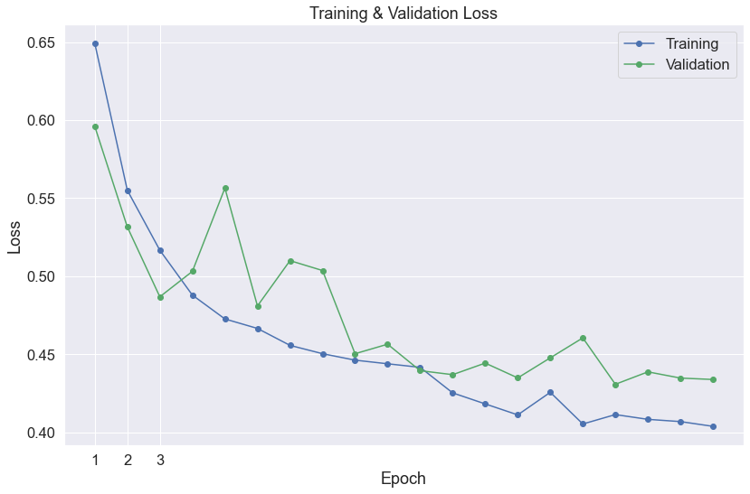
​    


```python
# Prediction on test set:

print('Predicting labels for {:,} test sentences...'.format(len(test_input_ids)))

# Put model in evaluation mode:

model.eval()

# Tracking variables :

predictions = []

# Predict:

for batch in prediction_dataloader:
    
  # Add batch to GPU

  batch = tuple(t.to(device) for t in batch)
  
  # Unpack the inputs from our dataloader:
    
  b_input_ids, b_input_mask, = batch
  
  # Telling the model not to compute or store gradients, saving memory and speeding up prediction:

  with torch.no_grad():
      # Forward pass, calculate logit predictions:
    
      outputs = model(b_input_ids, token_type_ids=None, 
                      attention_mask=b_input_mask)

  logits = outputs[0]

  # Move logits and labels to CPU:
    
  logits = logits.detach().cpu().numpy()
 
  
  # Store predictions and true labels:
    
  predictions.append(logits)


print('    DONE.')
```

    Predicting labels for 3,263 test sentences...
        DONE.


```python
# Getting list of predictions and then choosing the target value with using argmax on probabilities.

flat_predictions = [item for sublist in predictions for item in sublist]
flat_predictions = np.argmax(flat_predictions, axis=1).flatten()
```


```python
import os
os.getcwd()
```


    '/Users/hoonkijeong/Desktop/kaggle/NLP_with_disaster_tweets'


```python
# Creating submission data.
import os
submission = pd.read_csv(os.getcwd() + '/sample_submission.csv')
submission['target'] = flat_predictions
submission.head(10)
```


<div>
<style scoped>
    .dataframe tbody tr th:only-of-type {
        vertical-align: middle;
    }

    .dataframe tbody tr th {
        vertical-align: top;
    }
    
    .dataframe thead th {
        text-align: right;
    }
</style>
<table border="1" class="dataframe">
  <thead>
    <tr style="text-align: right;">
      <th></th>
      <th>id</th>
      <th>target</th>
    </tr>
  </thead>
  <tbody>
    <tr>
      <th>0</th>
      <td>0</td>
      <td>1</td>
    </tr>
    <tr>
      <th>1</th>
      <td>2</td>
      <td>1</td>
    </tr>
    <tr>
      <th>2</th>
      <td>3</td>
      <td>1</td>
    </tr>
    <tr>
      <th>3</th>
      <td>9</td>
      <td>1</td>
    </tr>
    <tr>
      <th>4</th>
      <td>11</td>
      <td>1</td>
    </tr>
    <tr>
      <th>5</th>
      <td>12</td>
      <td>1</td>
    </tr>
    <tr>
      <th>6</th>
      <td>21</td>
      <td>0</td>
    </tr>
    <tr>
      <th>7</th>
      <td>22</td>
      <td>0</td>
    </tr>
    <tr>
      <th>8</th>
      <td>27</td>
      <td>0</td>
    </tr>
    <tr>
      <th>9</th>
      <td>29</td>
      <td>0</td>
    </tr>
  </tbody>
</table>
</div>


```python
submission.to_csv('submission.csv', index=False, header=True)
```


```python

```
